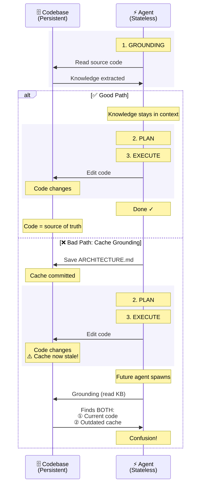

## The Knowledge Cache Anti-Pattern

You've extracted architectural knowledge from your codebase with an agent—clean diagrams, comprehensive API documentation, detailed component relationships. You save it as `ARCHITECTURE.md` and commit it. Now you have a cache invalidation problem: code changes (always), documentation doesn't (usually), and future agents find both during code research. The diagram below shows the divergence.

The moment you commit extracted knowledge, every code change requires documentation updates you'll forget. Source code is your single source of truth—code research tools (ChunkHound, semantic search, Explore) extract architectural knowledge dynamically every time, fresh and accurate. The distinction: **HOW** knowledge (implementation details, data flows, component relationships) is redundant with code—code research regenerates it on demand. **WHY** knowledge (rejected alternatives, business rationale, compliance mandates) can't be expressed in code. Commit the WHY as decision records—short documents capturing what was decided, why, and what alternatives were rejected. Let code research handle the HOW.

## Key Takeaways

- **Avoid knowledge cache anti-patterns** — Code research tools extract architectural knowledge dynamically from source code every time. Saving extracted knowledge to .md files creates unnecessary caches that become stale. Commit the WHY as decision records; let code research handle the HOW.

---

**Next:** [About](/about)
