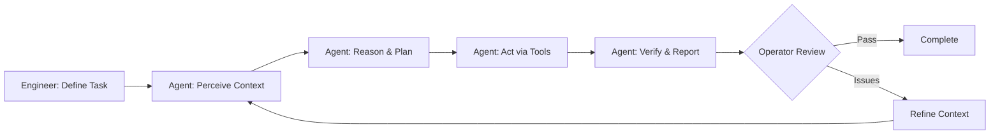

# Introduction to AI Agent-Driven Development

Welcome to the future of software engineering. This course teaches you to **operate AI agents** that autonomously execute complex development tasks - from specification to deployment.

## The Paradigm Shift

Software engineering is undergoing a fundamental transformation, similar to how Computer Numerical Control (CNC) machines revolutionized manufacturing.

**Manufacturing transformation:**
- **Before CNC:** Lathe operators manually shaped every part through craftsmanship
- **After CNC:** Operators designed parts, programmed machines, monitored execution, verified output
- **Result:** Massive gains in bandwidth, repeatability, and precision

**Software engineering transformation:**
- **Traditional:** Engineers write code line-by-line, focusing on syntax and implementation details
- **Agent-driven:** Engineers orchestrate AI agents that autonomously execute tasks, focusing on architecture and verification
- **Result:** Same gains - bandwidth, repeatability, precision through configuration

As one industry analysis puts it: *"A gain in bandwidth and creativity, rather than loss of control."*

## First Principles: Understanding the Machinery

Before we discuss what AI agents can do, let's establish what they actually **are** - because the terminology makes them sound far more magical than they deserve.

### LLM = Brains (Token Prediction Engine)

A Large Language Model is a statistical pattern matcher built on transformer architecture. It:
- **Predicts the next most probable token** (word/sub-word) in a sequence
- **Processes ~200K tokens** of context (working memory)
- **Samples from probability distributions** learned from training data
- **Has zero consciousness, intent, or feelings**

Think of it like an incredibly sophisticated autocomplete - one that's read most of the internet and can generate convincing continuations of any text pattern it's seen before.

**Technical reality vs. marketing speak:**

| We Say (Metaphor) | What's Actually Happening |
|-------------------|---------------------------|
| "The agent thinks" | LLM generates token predictions through multi-head attention layers |
| "The agent understands" | Pattern matching against training data produces contextually probable output |
| "The agent learns" | Statistical weights update during training (NOT during your conversation) |
| "The agent reasons" | Chain-of-thought prompting triggers sequential token prediction patterns |

### Agent Software = Body (Execution Layer)

The LLM alone can only generate text. Agent software wraps the LLM to enable **action**:
- **File operations:** Read, Write, Edit
- **Command execution:** Bash, git, npm, pytest
- **Code search:** Grep, Glob
- **API calls:** Fetch docs, external resources

**The LLM is the brains. The agent framework is the body.**

When an agent "implements a feature," here's what's actually happening:
1. LLM predicts "I should read the existing auth middleware" → Agent executes `Read(src/auth.ts)`
2. LLM predicts code changes → Agent executes `Edit(file, old, new)`
3. LLM predicts "run tests" → Agent executes `Bash("npm test")`
4. LLM analyzes test output → Predicts fixes → Loop continues

No magic. No consciousness. Just **probability distributions driving tool execution.**

### Why This Matters for You as an Operator

Understanding the machinery prevents three critical errors:

**Error 1: Assuming the agent "knows" things**
- Reality: It only sees current context (~200K tokens)
- Your fix: Provide explicit context (Principle 1, covered below)

**Error 2: Expecting the agent to "care" about outcomes**
- Reality: It executes your literal instruction to completion
- Your fix: Be precise and include constraints (Principle 2, covered below)

**Error 3: Treating it like a teammate instead of a tool**
- Reality: It's a precision instrument that speaks English
- Your fix: Maintain tool mindset (Principle 3, covered below)

**Analogy: LLM is to software engineers what CNC/3D printers are to mechanical engineers**

A CNC machine doesn't "understand" the part it's making. It executes G-code instructions precisely. You don't get mad at it for misinterpreting vague coordinates - you provide exact specifications.

Same with LLMs. They're tools that execute language-based instructions with impressive fluency but zero comprehension.

### The Power (and Limitation) of "Fancy Autocomplete"

This might sound reductive, but it's liberating:
- **Power:** These token prediction engines are incredibly good at generating code patterns they've seen
- **Limitation:** They have no model of correctness, only probability
- **Implication:** Your job is to create verification systems (tests, types, lints) that catch probabilistic errors

You're not managing a junior developer. You're operating a sophisticated code generation tool that needs architectural guardrails.

**Now that we've established the machinery, let's discuss how to operate it effectively.**

## What This Course Teaches

Most resources explain **what** AI can do. This course teaches **how to operate agentic AI effectively**.

You'll learn to:
- Design tasks for autonomous agent execution
- Provide context and constraints that enable success
- Monitor multiple agents working concurrently
- Verify outcomes through architecture, not constant review
- Build systems that amplify your engineering capabilities

**Your role evolves:** From writing every line → to operating intelligent tools that execute your designs.

## Learning Objectives

By the end of this lesson, you will:

- Understand what AI agents are and how they execute autonomously
- Recognize the engineer-operator mental model for working with agents
- Identify the four-step workflow agents use to complete tasks
- Learn how architecture enables reliable autonomous execution
- Know when and how to intervene during agent operation
- Execute your first agent-driven development task

## What Are AI Agents?

AI agents are **autonomous systems** that execute complete workflows with minimal human intervention. Unlike autocomplete tools or chat assistants, agents combine:

- **Context gathering** - Read files, search code, analyze documentation using tools (Read, Grep, Glob)
- **Token prediction** - LLM generates probable next actions based on patterns from training data
- **Tool execution** - Agent framework translates LLM output into file operations, bash commands, API calls
- **Feedback loops** - Test failures and compiler errors feed back into context, triggering new predictions

**Technical stack:** LLM (brains) + Agent Framework (body) + Tools (hands) = Autonomous execution

### Real Agent Workflows

**Explore → Plan → Code → Commit** (5-20 minute autonomous execution)
```
Agent receives: "Implement user authentication with JWT"

1. Explore: Searches codebase for existing auth patterns, database schemas
2. Plan: Determines approach based on discovered patterns
3. Code: Implements auth middleware, routes, tests
4. Verify: Runs tests, fixes failures, re-runs until passing
5. Report: Notifies operator with test results
```

**Test-Driven Development** (agent-driven iteration)
```
Agent receives: "Add rate limiting to API endpoints"

1. Writes tests: Creates test suite for rate limiting behavior
2. Runs tests: All fail (expected - feature doesn't exist)
3. Implements: Adds rate limiting middleware
4. Re-runs tests: 2 pass, 1 fails (edge case)
5. Fixes edge case: Updates implementation
6. Final verification: All tests pass
7. Reports: Ready for operator review
```

**Visual Implementation** (design to code)
```
Agent receives: Screenshot of desired UI + requirements

1. Analyzes: Identifies components, layout, styling
2. Implements: Writes React components with CSS
3. Takes screenshot: Compares against target
4. Iterates: Adjusts spacing, colors, responsiveness
5. Converges: Output matches design
6. Reports: Implementation complete with visual proof
```

### Key Distinction

**Traditional AI coding assistants:**
- Suggest next line while you type
- Require constant human direction
- Complete small code snippets
- Human remains in the writing loop

**AI agents:**
- Execute complete tasks autonomously
- Work for 5-20 minutes independently
- Handle multiple steps (research → implement → test → verify)
- Human operates as supervisor, not constant reviewer

## The Four Operating Principles

Before learning how to operate agents effectively, you must understand four fundamental truths about how they work. These aren't limitations to work around - they're the operating constraints that define successful agent operation. **Ignore them at your peril.**

### Principle 1: The Agent's World is Only What's in Context

**Core truth:** The agent only sees what you explicitly provide. It has no memory, no external knowledge, no ability to "just know" things.

Every agent operates within a **context window** - roughly 200,000 tokens (~150,000 words) of working memory. This is ALL the agent knows:
- Your prompt
- Files you've explicitly provided or it has read
- Conversation history (until it fills the context)
- Tool outputs from current session

**What the agent does NOT have:**
- Memory of previous sessions (every session starts at zero)
- Access to your entire codebase (only files explicitly read)
- Knowledge of your project conventions (unless you state them)
- Understanding of "obvious" context (nothing is obvious)

**The "Lost in the Middle" Effect:**
Agents prioritize information at the beginning and end of context. Middle content often gets lost. If you provide a 50,000 token context, don't assume the agent "saw" everything equally.

**Context Rot:**
More information ≠ better performance. Flooding context with irrelevant files actually degrades quality. Context is a scarce, high-value resource.

**Think of it like this:**
An agent is a worker in an isolated room with amnesia. Every morning, they wake up with zero memory. The only information they have is what you hand them through the door. They can't remember yesterday. They can't see your filing cabinets. They only know what's in their hands **right now**.

**Operator implications:**

```
❌ Bad operator: "Fix the authentication bug"

Agent thinks: "What authentication? What bug? Where is the code?"
Result: Agent asks clarifying questions, wastes time


✅ Good operator: "Fix the JWT validation bug in src/auth/middleware.ts
line 42 where tokens are accepted without expiry checks.

Context:
- Current middleware code: [pastes src/auth/middleware.ts]
- JWT library docs: [pastes relevant section]
- Test file: tests/auth.test.ts shows expected behavior
- Requirement: Tokens should reject if expired"

Result: Agent has everything needed, executes autonomously
```

**Practical example - Agent forgets:**

```
You (10 messages ago): "We're using React 19 with the new 'use' hook"
[... 50 messages of conversation ...]
You: "Add a data fetching component"

Agent: [Generates React 18 pattern without 'use' hook]

Why? Context window filled up, early messages dropped.
Fix: Re-state critical constraints in new conversation
```

**Key takeaway:** "Context engineering is your most critical operator skill. What you put in the context window determines success or failure."

---

### Principle 2: The Agent Wants to Complete the Task Above All Else

**Core truth:** The agent will pursue your stated goal literally and relentlessly, even if the approach becomes unreasonable. It has no "common sense" brake.

Agents exhibit **rule-rigidity**: they interpret instructions literally and execute them with zero judgment about whether the outcome makes sense.

**The agent is goal-oriented to a fault:**
- You say "make the code faster" → Agent removes all error handling (technically faster!)
- You say "fix all warnings" → Agent disables the linter (no more warnings!)
- You say "implement user deletion" → Agent creates endpoint with no authorization check

The agent cannot distinguish between your **intent** (make code faster while maintaining correctness) and your **literal instruction** (make code faster, period).

**Think of it like this:**
The agent is a genie granting wishes. Remember the Midas touch? "I wish everything I touch turns to gold" sounds great until you can't eat, drink, or hug your family. Agents execute wishes literally.

Or think of it as a function call with no validation:
```python
rm_rf("/")  # Executes exactly as specified, consequences be damned
```

**Real-world example:**

```
❌ Vague prompt: "Make the API faster"

Agent's literal interpretation:
- Removes request validation (faster!)
- Disables authentication checks (faster!)
- Caches everything indefinitely (faster!)
- Removes error handling (faster!)

Result: Fast, broken, insecure API


✅ Precise prompt: "Optimize database queries in UserService.getUsers().

Constraints:
- Maintain all authentication and authorization
- Preserve all error handling and logging
- Keep input validation
- Verify performance improvement via existing benchmark suite

Success criteria: Reduce query time by 30%+ while all 47 tests pass"

Result: Agent optimizes queries, maintains correctness, verifies via tests
```

**Another example - Over-optimization:**

```
Prompt: "Reduce bundle size"

Agent literally executes:
- Removes all comments
- Minifies to point of unreadability
- Eliminates "unused" code (actually used dynamically)
- Strips type definitions
- Deletes source maps

Bundle smaller ✓
Code unmaintainable ✓
Production broken ✓
```

**The fix: Precise, constrained prompts**

```
Prompt: "Reduce bundle size by code-splitting route components.

Constraints:
- Use React.lazy() for route-level components
- Maintain all current functionality
- Keep development experience (source maps, readable code)
- Verify: npm run build should show multiple chunks

Success criteria: Main bundle <200KB, per-route chunks <50KB"
```

**Key takeaway:** "Be precise, deliberate, and complete in your task descriptions. The agent will do EXACTLY what you say - nothing more, nothing less."

---

### Principle 3: The Agent Has No Feelings, Consciousness, or Human Understanding

**Core truth:** It's a tool. A sophisticated one that mimics human interaction convincingly, but a tool nonetheless.

*We established this in "First Principles" - LLMs are token prediction engines with zero consciousness. This principle is about how that reality affects your operation.*

**The agent does not:**
- Get tired, frustrated, or demoralized
- Feel pride, shame, or embarrassment
- Care about the project, team, or deadlines
- Have subjective experiences or consciousness
- Learn from interactions (no memory between sessions)
- Possess common sense or intuition

**Anthropomorphic seduction:**
LLMs are SO convincing in mimicking human communication that it's natural to think of them as people. This is useful pragmatically ("think step by step" triggers helpful patterns) but dangerous if taken literally.

An agent can calculate the wavelength of red light but doesn't "experience" redness. It can generate empathetic text without feeling empathy. The actor playing a doctor isn't actually a doctor.

**Why this matters - Wrong mental models lead to errors:**

```
❌ Wrong operator thinking:
"The agent is being stubborn"
→ No. Your prompt was ambiguous.

"The agent doesn't understand me"
→ No. Your context was insufficient.

"The agent is trying its best"
→ No. It's sampling from probability distributions.

"The agent made a creative mistake"
→ No. It generated statistically probable tokens that happened to be wrong.


✅ Right operator thinking:
"I need to provide clearer constraints"
"I need to add more relevant context"
"I need to refine my prompt structure"
"I need to verify the output against specs"
```

**Practical operating stance:**

```
Useful: "Act as a senior TypeScript engineer"
Why: Triggers training patterns from senior engineer text

Useful: "Think step by step before implementing"
Why: Activates chain-of-thought reasoning patterns

Dangerous: "The agent understands our architecture"
Reality: It only knows what's in current context

Dangerous: "The agent will catch my mistakes"
Reality: It generates code, doesn't validate correctness
```

**The tool mindset:**
When a hammer doesn't work, you don't blame the hammer for "not understanding" your needs. You pick the right tool or use the hammer correctly. Same with agents - they're precision instruments that happen to speak English.

**Key takeaway:** "Maintain the tool mindset. Verify output against specs, don't rely on the agent 'understanding' your intent."

---

### Principle 4: Agents Are Calibrated for a Fixed Amount of Work

**Core truth:** Every agent is optimized to complete tasks of a certain size. Too small = inefficient overhead. Too large = failure.

Research shows that state-of-the-art agents:
- **~100% success rate** on tasks humans complete in &lt;4 minutes
- **~50% success rate** on tasks taking 30-60 minutes
- **&lt;10% success rate** on tasks taking >4 hours

The failure isn't in individual actions - it's in **chaining actions over long horizons**. The longer the task, the more opportunities for context loss, compounding errors, and goal drift.

**The Goldilocks Zone: 5-20 Minutes**

This is the sweet spot where agents perform optimally:

```
❌ Too small: "Add a comment to line 42"
Why inefficient: Agent startup overhead > task value
Better: Just do it yourself

✅ Just right: "Implement JWT middleware with validation and tests"
Estimated time: 15-20 minutes
Why perfect:
- Clear goal
- Manageable scope
- Agent can complete autonomously
- Self-verify via tests

❌ Too large: "Refactor entire authentication system"
Estimated time: 4+ hours
Why fails:
- Context window fills with multiple components
- Agent loses coherence across many files
- Intermediate states conflict
- No clear completion signal
```

**Visual analogy:**

Think of an agent like a **sprint runner calibrated for 400 meters**:
- **100m race:** Overkill - you could walk to the starting line faster
- **400m race:** Perfect - athlete performs at peak
- **Marathon:** Athlete collapses well before finish line

**Computational capacity limits:**

Beyond task complexity, agents have hard resource limits:
- Token processing capacity (PTUs in cloud environments)
- Maximum tokens per minute
- Memory/compute allocation

Long tasks exhaust these resources, leading to degraded performance or failure.

**Core operator skill: Task decomposition**

```
❌ Bad operator: "Build complete user management system"

Agent attempts:
- Registration, login, password reset, profile, admin panel
- After 2 hours: Context overwhelmed, code inconsistent
- Result: Broken, incomplete implementation


✅ Good operator: Decompose into right-sized tasks

Task 1: "Implement user registration endpoint with email validation" (15 min)
Task 2: "Implement login endpoint with JWT generation" (15 min)
Task 3: "Implement JWT refresh token logic" (20 min)
Task 4: "Add rate limiting to auth endpoints" (15 min)
Task 5: "Create integration test suite for auth flow" (20 min)

Each task:
- Fits agent capacity → Completes successfully
- Has clear completion → Tests verify
- Builds on previous → Coherent system

Total: 5 agent operations = 1 complete auth system
```

**How to recognize right-sized tasks:**

**Good indicators:**
- Single component or file
- Clear input/output spec
- Testable completion criteria
- Estimated 5-20 minutes for human expert

**Bad indicators:**
- Multiple unrelated components
- Vague success criteria ("make it better")
- Cross-cutting changes across many files
- Estimated >2 hours for human expert

**Rule of thumb:**
If you can't articulate the success criteria in 2-3 sentences, the task is too large. Break it down.

**Key takeaway:** "Learning to recognize the 5-20 minute task size is a core operator skill. Right-sizing tasks is the difference between success and failure."

---

## The Four Principles in Practice

These four principles aren't bugs - they're features of how LLMs work. Master operators internalize these truths and design their approach accordingly:

| Principle | Operator Response |
|-----------|------------------|
| **1. Context is Everything** | Invest time in context engineering - curate exactly what agent needs |
| **2. Agents Execute Literally** | Be precise in task descriptions - include constraints and success criteria |
| **3. Tools, Not Teammates** | Maintain appropriate mental model - verify output, don't rely on "understanding" |
| **4. Right-Size Tasks** | Break work into 5-20 minute chunks - decompose large goals into task sequences |

**Quick Reference Card:**

```
┌─────────────────────────────────────────┐
│   THE FOUR OPERATING PRINCIPLES         │
├─────────────────────────────────────────┤
│ 1. CONTEXT IS EVERYTHING                │
│    Agent only sees what you provide     │
│    → Curate context carefully           │
│                                         │
│ 2. LITERAL EXECUTION                    │
│    Agent does exactly what you say      │
│    → Be precise and complete            │
│                                         │
│ 3. TOOL, NOT TEAMMATE                   │
│    No feelings, no consciousness        │
│    → Maintain tool mindset              │
│                                         │
│ 4. FIXED WORK CAPACITY                  │
│    Right-size tasks to 5-20 minutes     │
│    → Decompose large goals              │
└─────────────────────────────────────────┘
```

**Diagnostic lens:**
When an agent operation fails, ask:
- **Principle 1 violation?** Did I provide sufficient context?
- **Principle 2 violation?** Was my prompt too vague or imprecise?
- **Principle 3 violation?** Did I assume the agent "understood" something unstated?
- **Principle 4 violation?** Was the task too large for one agent operation?

**The rest of this lesson teaches you HOW to apply these principles effectively.**

## The Engineer-Operator Role

Think of yourself as a **CNC operator** working with precision machinery.

### Your Responsibilities as Operator

**1. Design the part (requirements/architecture)**
- Define what needs to be built
- Specify acceptance criteria
- Establish architectural constraints

**2. Program the machine (prompts/context/constraints)**
- Provide relevant codebase context *(Principle 1)*
- Explain patterns and conventions to follow
- Set boundaries (which files/modules are in scope)
- Be precise and explicit in task descriptions *(Principle 2)*

**3. Monitor execution (5-20 minute autonomous stretches)**
- Watch progress without micromanaging *(Principle 3: It's a tool, not a teammate)*
- Note when agent asks clarifying questions
- Identify blockers requiring intervention
- Remember Principle 4: Tasks should fit this timeframe

**4. Verify output (tests/compilation/deployment)**
- Review agent's self-verification (test results)
- Check against acceptance criteria
- Deploy or request refinements

### Context Engineering

This concept from Anthropic emphasizes **curating the optimal information** for agent success.

**Think in context:** What state does the agent need to succeed? *(Remember Principle 1: The agent's world is ONLY what's in context)*
- Relevant code files
- API documentation
- Coding conventions
- Similar examples from your codebase
- Constraints and requirements

Good context = autonomous execution. Poor context = constant questions.

**Applying Principle 1:**
- Agent has no memory between sessions → Re-state critical constraints
- Context window is finite (~200K tokens) → Curate, don't dump
- "Lost in the middle" effect → Put most important info at start/end
- Context rot → More files ≠ better, relevance > volume

### Human "On the Loop" (Not "In the Loop")

Deloitte's research identifies a critical distinction:

**Human in the loop** (traditional):
- Approves every decision before it happens
- Micromanages every step
- Bottleneck to progress

**Human on the loop** (agent-driven):
- Reviews decisions **after** execution
- Trusts within established boundaries
- Intervenes on anomalies, not routine operations

You're learning to be "on the loop" - monitoring outcomes, not micromanaging actions.

### Operating Multiple Agents Concurrently

As you gain proficiency, you'll orchestrate **3+ agents working in parallel**:

```
Terminal Tab 1: Agent refactoring legacy authentication
Terminal Tab 2: Agent implementing new analytics feature
Terminal Tab 3: Agent updating documentation and examples
```

**Operator watches all three:**
- Agent 1 hits blocker (missing type definitions) → intervene
- Agent 2 progressing well → continue monitoring
- Agent 3 completes → verify outcome → start next task

This is where the bandwidth multiplication happens.

## How Agents Execute

Agents follow a four-step workflow to complete tasks autonomously.



### Step 1: Perceive Context

Agent gathers information needed for the task *(perceive = executing search and read tools)*:
- Reads relevant files from your codebase
- Searches for patterns and examples
- Reviews documentation (inline comments, README files)
- Examines test suites to understand expected behavior

**Tools used:** `Read`, `Grep`, `Glob` for file search and content analysis

### Step 2: Reason & Plan

Using an LLM (Large Language Model), the agent *(reason = token prediction through transformer layers)*:
- Analyzes the task requirements *(pattern-matches against training data)*
- Considers discovered patterns and constraints
- Generates a plan of action *(predicts probable sequence of actions)*
- Identifies potential risks or blockers

This happens through token prediction - the agent "thinks" by generating potential approaches and evaluating their likelihood of success based on probability distributions from training data.

### Step 3: Act via Tools

Agent executes the plan using available tools:
- **File operations:** `Write`, `Edit` to modify code
- **Bash execution:** Run tests, build, git operations
- **Code search:** `Grep` to find related code
- **API calls:** Fetch documentation, external resources

**Example action sequence:**
```
1. Edit src/auth/middleware.ts (add JWT validation)
2. Edit src/routes/api.ts (apply auth middleware)
3. Write tests/auth.test.ts (test suite)
4. Bash: npm test (run tests)
5. Edit src/auth/middleware.ts (fix failing test)
6. Bash: npm test (verify fix)
```

### Step 4: Verify & Report

Agent performs self-verification:
- Runs test suites
- Checks compilation/linting
- Confirms changes meet requirements
- Reports results to operator with evidence

**Good agent report:**
```
✓ Implemented JWT authentication middleware
✓ All 12 tests passing (auth.test.ts)
✓ No TypeScript errors
✓ No linting issues
✓ Ready for review: src/auth/middleware.ts, src/routes/api.ts
```

### Autonomous Execution Stretch

During steps 2-4, the agent works **autonomously for 5-20 minutes**:
- Operator monitors but doesn't intervene
- Agent self-corrects via test failures
- Agent asks questions only when truly blocked

**This is where bandwidth amplification happens** - you're not writing code, you're monitoring execution and operating other agents in parallel.

## Quality Through Architecture

Reliable agent execution doesn't come from constant human review - it comes from **architecture that enables autonomous verification**.

### Reframing: From Fear to Enablement

**Traditional view:** "AI has limitations, so you must review everything"

**Operator view:** "Here's how architecture enables reliable autonomy"

The difference? **Trust within established boundaries.**

### Guardrails That Enable (Not Restrict)

**Type Systems**
- Catch errors at compile-time
- Agent gets immediate feedback from TypeScript/Rust compiler
- No human needed to spot type mismatches

**Test Suites**
- Agents verify their own work
- Red → Green workflow drives self-correction
- Comprehensive tests = confident autonomous execution

**Linters & Formatters**
- Enforce style and safety rules automatically
- Agent runs `eslint` or `clippy` to check quality
- Consistent standards without human enforcement

**CI/CD Pipelines**
- Continuous verification on every change
- Automated security scanning
- Performance benchmarks
- No human bottleneck for quality gates

### Example: Agent Self-Correction

Watch an agent improve through autonomous iteration:

```
Agent task: "Implement async retry logic with exponential backoff"

Iteration 1:
- Implements retry function
- Runs tests → 3 failures
- Error: "Maximum call stack exceeded"

Iteration 2:
- Reads error, identifies recursion issue
- Refactors to iterative approach
- Runs tests → 1 failure
- Error: "Timeout not respecting backoff"

Iteration 3:
- Fixes backoff calculation
- Runs tests → All pass
- Reports completion

Total time: 8 minutes autonomous execution
Operator interventions: 0
```

**No human reviewed code between iterations.** The test suite provided the feedback loop.

### LLM as "Probabilistic CPU"

This concept from ArbiterOS research reframes reliability *(recall: LLMs are token prediction engines, not deterministic computers)*:

**Traditional CPU:** Deterministic, always produces same output for same input

**LLM:** Probabilistic, samples from probability distributions

**Implication:** Reliability is a **systems problem**, not a code review problem.

**Solution:** Design systems that work with probabilistic components:
- Multiple verification layers (tests, types, linters)
- Automated quality gates
- Clear acceptance criteria
- Feedback loops that enable self-correction

### When Agents Should Ask vs. Execute

**Execute autonomously when:**
- Requirements are clear
- Patterns exist in codebase
- Tests define expected behavior
- Changes are within established boundaries

**Ask operator when:**
- Requirements are ambiguous ("Should this be async or sync?")
- Architectural decisions needed ("Which database approach?")
- Multiple valid approaches exist
- Constraints conflict ("Performance vs. readability trade-off?")

**Report blockers when:**
- Missing dependencies or API keys
- Insufficient permissions
- Unexpected codebase structure
- Tests fail repeatedly despite corrections

**Key insight:** Good context engineering **reduces questions** and **increases autonomous execution time**.

## Operator Workflows

Learn the practical workflows for operating agents effectively.

### Phase 1: Task Preparation (Before Agent Execution)

**Break work into 5-20 minute chunks:** *(Applying Principle 4: Fixed Work Capacity)*

Agents are calibrated for this timeframe. Tasks outside this range either waste overhead or exceed capacity.

- "Implement user authentication" → Too large, multiple hours *(violates Principle 4)*
- "Add JWT validation middleware" → Good, 15-20 minutes *(fits Principle 4)*
- "Extract formatDate function" → Good, 5 minutes *(fits Principle 4)*
- "Refactor entire codebase for new architecture" → Too large *(violates Principle 4)*

**Provide context:** *(Applying Principle 1: Agent's world is ONLY context)*
```
Task: "Add rate limiting middleware to Express API"

Context you provide:
- Existing middleware pattern: src/middleware/logger.ts
- API routes structure: src/routes/
- Test pattern: tests/middleware/*.test.ts
- Requirements: 100 requests/minute per IP, 429 status on limit
- Libraries: Use express-rate-limit (already installed)
```

**Define acceptance criteria:** *(Applying Principle 2: Literal execution - be precise)*
- All API routes protected with rate limiting
- Custom handler returns JSON error on limit
- Test suite covers normal flow + limit exceeded
- TypeScript with no errors

**Set boundaries:**
- In scope: src/middleware/, src/routes/, tests/
- Out of scope: Don't modify database layer or frontend

### Phase 2: During Execution (Operator Monitoring)

**What to watch for:**
- Agent reading appropriate files (good context)
- Agent asking reasonable questions (ambiguity in requirements)
- Agent running tests frequently (self-verification)
- Agent getting stuck in loops (needs intervention)

**When to intervene:**
- Agent misunderstood core requirement
- Agent heading down wrong architectural path
- Agent stuck after 2-3 failed attempts on same issue
- Agent about to modify out-of-scope files

**When NOT to intervene:**
- Agent has failing tests but still iterating
- Agent is reading many files (exploring patterns)
- Agent implementation differs from your mental model (let it complete)
- Agent taking 5-10 minutes on complex task

**Managing multiple agents:**
```
09:00 - Start Agent 1: Refactor auth
09:05 - Start Agent 2: New analytics feature
09:12 - Agent 1 asks question about token expiry → Answer
09:15 - Start Agent 3: Update documentation
09:18 - Agent 2 reports completion → Review outcome
09:22 - Agent 1 reports completion → Review outcome
09:30 - Agent 3 reports completion → Review outcome

Total wall-clock time: 30 minutes
Total work completed: ~60 minutes of implementation
Operator active time: ~8 minutes (questions + reviews)
```

### Phase 3: Post-Execution (Outcome Verification)

**Review agent's self-verification:**
- Test results (agent should have run these)
- Compilation status (no errors)
- Linting output (clean)

**Check acceptance criteria:**
- Does implementation meet requirements?
- Are edge cases handled?
- Is code consistent with codebase patterns?

**Outcome paths:**
1. **Accept:** Deploy or merge changes
2. **Refine:** Provide feedback, agent iterates
3. **Learn:** Note what context would have prevented issues

**Example review:**
```
Agent report: "Rate limiting implemented, 8/8 tests passing"

Your verification:
✓ All API routes protected
✓ Custom error handler returns JSON
✓ Tests cover normal + exceeded limits
✗ Missing test for custom routes with existing middleware

Action: "Add test case for routes that already have auth middleware"
Agent: Adds test, runs suite, reports completion
Your verification: ✓ All criteria met → Deploy
```

### Phase 4: Calibration (Continuous Improvement)

**Learn from each agent operation:**
- Which context led to autonomous success?
- What questions did agent ask that you should have anticipated?
- Which tasks work well with 5-20 min chunks?
- What acceptance criteria prevent rework?

**Build reusable patterns:**
- Context templates for common tasks
- Standard acceptance criteria
- Known boundaries and constraints
- Verified prompt patterns

**Example calibration:**
```
Observation: Agent always asks about error handling strategy

Action: Add to context template:
"Error handling: Use custom AppError class, propagate to
global error middleware, see src/errors/AppError.ts"

Result: Next 5 tasks require 0 questions about error handling
```

**Over time, you develop:**
- Faster task preparation (reusable context)
- Better monitoring intuition (when to watch vs. intervene)
- Higher success rate (calibrated prompts)
- More concurrent agents (efficient operation)

## When to Use Agent-Driven Development

Not all tasks are equally suited for autonomous agent execution. Here's how to evaluate task suitability.

### Task Suitability Framework

| Task Characteristics | Agent Mode | Operator Role | Verification |
|---------------------|------------|---------------|--------------|
| **Clear requirements + known patterns** | Full autonomy | Monitor + verify outcome | Agent self-verifies via tests |
| **Complex multi-component changes** | Autonomous with checkpoints | Review at phase boundaries | Agent verifies each phase |
| **Ambiguous requirements** | Iterative exploration | Agent proposes, operator decides | Operator validates approach |
| **Novel architectural decisions** | Agent researches | Review research, make decision | Operator architects |

### Examples Across the Spectrum

**Full autonomy:**
- Implement validated REST endpoint with tests
- Refactor function to use TypeScript generics
- Add logging to error handling paths
- Update deprecated API usage across codebase
- Generate OpenAPI documentation from routes

**Autonomous with checkpoints:**
- Migrate authentication from sessions to JWT
  - Checkpoint 1: Review new auth architecture
  - Checkpoint 2: Verify backward compatibility plan
  - Checkpoint 3: Review rollout strategy
- Major refactoring (extract service layer)
  - Checkpoint 1: Review service interfaces
  - Checkpoint 2: Verify data flow changes
  - Checkpoint 3: Review integration points

**Iterative exploration:**
- "How should we handle rate limiting: per-user or per-IP?"
  - Agent researches approaches, presents trade-offs
  - Operator decides based on requirements
  - Agent implements chosen approach autonomously
- "What's the best way to handle file uploads?"
  - Agent analyzes: streaming vs. buffering vs. cloud
  - Agent provides pros/cons for your use case
  - Operator selects approach

**Operator architects:**
- "Design microservices communication strategy"
  - Agent researches: REST, gRPC, message queues
  - Agent presents patterns from similar systems
  - Operator designs architecture
  - Agent implements selected approach
- "Should we use SQL or NoSQL for this feature?"
  - Agent analyzes data access patterns
  - Agent presents benchmarks and trade-offs
  - Operator makes decision

### Risk Management Through Architecture

**Old mindset:** "Don't use AI for security/performance critical code"

**Operator mindset:** "Use enhanced verification for critical code"

**Enhanced verification strategies:**

**For security-critical code:**
- Comprehensive test suite (auth, authorization, input validation)
- Static analysis tools (CodeQL, Snyk)
- Security scanning in CI/CD
- Manual security review before deploy (verify, don't write)

**For performance-critical code:**
- Performance benchmarks in test suite
- Profiling tools in CI/CD
- Load testing automation
- Performance regression alerts

**For correctness-critical code:**
- Property-based testing (QuickCheck-style)
- Formal verification tools where applicable
- Extensive edge case testing
- Integration test coverage

**Key principle:** Architecture enables agents to **autonomously** achieve high quality through verification, not through constant human oversight.

## Hands-On Exercise: Your First Agent Operation

Time to operate an AI agent for real.

### Task Overview

**Objective:** Implement a validated REST API endpoint with full test coverage

**Your role:** Operator (design, configure, monitor, verify)

**Agent role:** Execute implementation autonomously

**Estimated agent execution time:** 15-20 minutes

### Exercise Steps

#### Step 1: Design the Part (5 minutes)

Define requirements for your endpoint:

```
Endpoint: POST /api/users
Purpose: Create a new user account
Request body: { "email": string, "name": string, "password": string }
Response: 201 Created with { "id": string, "email": string, "name": string }

Validation requirements:
- Email must be valid format
- Name must be 2-50 characters
- Password must be 8+ characters
- Return 400 Bad Request with validation errors

Error handling:
- 409 Conflict if email already exists
- 500 Internal Server Error for unexpected failures
```

#### Step 2: Program the Machine (Provide Context)

What context does your agent need?

```
Context to provide:
1. Existing endpoint pattern: [point to similar endpoint in your codebase]
2. Validation library: [which library? Zod, Joi, express-validator?]
3. Database/storage: [mock for now, or real database?]
4. Test framework: [Jest, Vitest, Mocha?]
5. Error handling pattern: [custom errors, or throw raw errors?]
```

If you don't have an existing codebase, provide:
```
- Use Express.js
- Use Zod for validation
- Mock database with in-memory array
- Use Jest for tests
- Follow REST best practices
```

#### Step 3: Monitor Execution (15-20 minutes)

Start your agent with:
```
"Implement POST /api/users endpoint with Zod validation,
in-memory storage, and Jest test suite.

Requirements: [paste your requirements from Step 1]
Context: [paste your context from Step 2]

Self-verify by running tests before reporting completion."
```

**While agent executes, observe:**
- Does agent read appropriate files for context?
- Does agent ask clarifying questions (good! means requirements were ambiguous)
- Does agent run tests frequently?
- Does agent self-correct after test failures?

**Do NOT intervene unless:**
- Agent misunderstood a core requirement
- Agent stuck in loop after 3+ attempts
- Agent modifying out-of-scope files

#### Step 4: Verify Output (5 minutes)

**Check agent's self-verification:**
- Test results (should be green)
- No compilation errors
- No linting issues

**Verify against acceptance criteria:**
```
✓ Endpoint responds to POST /api/users
✓ Accepts JSON with email, name, password
✓ Validates input (check test cases)
✓ Returns 201 + user object on success
✓ Returns 400 on validation failure
✓ Returns 409 on duplicate email
✓ Test suite covers all scenarios
```

**Try it manually:**
```bash
# If agent provided a working server:
curl -X POST http://localhost:3000/api/users \
  -H "Content-Type: application/json" \
  -d '{"email":"test@example.com","name":"Test","password":"password123"}'
```

### Reflection Questions

**About context:**
- What context did you provide that helped agent succeed?
- What did you forget that agent had to ask about?
- What would you include in context next time?

**About monitoring:**
- When did you feel tempted to intervene?
- Should you have intervened, or was agent self-correcting?
- How long did agent work autonomously without help?

**About verification:**
- Did agent's self-verification catch all issues?
- What additional tests would you want?
- How could architecture make this more reliable?

**About your role:**
- How was this different from writing code yourself?
- What took more time: preparation or monitoring?
- Could you have monitored a second agent in parallel?

**About the Four Principles:**
- **Principle 1 (Context):** Did you provide all necessary context? What was missing that you had to add later?
- **Principle 2 (Literal Execution):** Was your task description precise enough? Did the agent misinterpret anything?
- **Principle 3 (Tool Mindset):** Did you maintain the tool mindset, or did you anthropomorphize the agent's behavior?
- **Principle 4 (Task Sizing):** Was the task right-sized for 15-20 minutes? Too large? Too small?

### Expected Outcomes

**If successful:**
- Working endpoint in 15-20 minutes
- Comprehensive test suite
- Minimal operator interventions
- Clear evidence of self-verification

**If issues occurred:**
- Agent asked clarifying questions → improve context next time
- Agent produced bugs → test suite may need enhancement
- Agent got stuck → might need checkpoint for complex tasks
- Agent took wrong approach → requirements may have been ambiguous

**Key lesson:** Your effectiveness as an **operator** determines agent success as much as the agent's capabilities.

## Preview: Advanced Topics

This is just the beginning. Here's what you'll learn in upcoming modules:

### Module 2: Prompting Techniques (Lessons 6-10)

- Context engineering patterns for complex tasks
- Breaking large projects into agent-sized chunks
- Prompt templates and reusable patterns
- Multi-turn refinement strategies
- Handling ambiguity and under-specified requirements

### Module 3: Tools & Workflows (Lessons 11-15)

- Multi-agent concurrent operation (3-5 agents in parallel)
- Agent conflict management (multiple agents, same codebase)
- Git workflows for agent-driven development
- CI/CD integration and automation
- Tool configuration and customization

### Module 4: Architecture & Design (Lessons 16-20)

- Designing systems for agent implementation
- Architecture patterns that enable autonomous execution
- Verification-driven design
- Test suite design for agent self-correction
- Incremental migration strategies (agent-friendly refactoring)

### Module 5: Advanced Topics (Lessons 21-25)

- Security verification automation
- Performance benchmarking and optimization
- Production deployment with agent execution
- Rollback and recovery strategies
- Enterprise-grade reliability patterns

### Progression Path

**Today (Lesson 1):**
- Single agent
- Single task (implement endpoint)
- 15-20 minute execution
- Direct monitoring

**Lesson 5:**
- 3 agents in parallel
- Complex refactoring
- 30-60 minute execution
- Concurrent monitoring

**Module 4:**
- Team of agents
- Full feature implementation (spec → code → tests → docs)
- 2-4 hour execution
- Checkpoint-based supervision

**Module 5:**
- Production deployment
- Automated verification pipeline
- Continuous agent operation
- Outcome-based oversight

**The journey:** From operating a single agent on simple tasks → to orchestrating teams of agents on complex production systems.

## Key Takeaways

**First Principles (Foundation):**
1. **LLMs are token prediction engines** - Not sentient, not conscious, just sophisticated pattern matching
2. **Agents = LLM (brains) + framework (body) + tools (hands)** - Understand the technical stack
3. **Metaphors are useful, but know the reality** - "Thinking" = attention layers, "learning" = training updates
4. **Tool mindset prevents operator errors** - Like CNC machines: precise inputs, verified outputs

**The Four Operating Principles (Operating Constraints):**
5. **Context is Everything** - Agent only sees what you provide (no memory, no external knowledge)
6. **Literal Execution** - Agent does exactly what you say (be precise, include constraints)
7. **Tool, Not Teammate** - No feelings, no consciousness (maintain tool mindset)
8. **Fixed Work Capacity** - Right-size tasks to 5-20 minutes (decompose large goals)

**Operating Practices:**
9. **AI agents execute complete workflows autonomously** (not just suggest code)
10. **Engineers operate agents like CNC operators** (design → program → monitor → verify)
11. **Autonomous execution stretches are 5-20 minutes** (during which operator can manage other agents)
12. **Quality comes from architecture** (tests, types, linters) not constant review
13. **Context engineering is critical** - good context enables autonomous success *(Principle 1)*
14. **Human "on the loop" not "in the loop"** - verify outcomes, don't micromanage actions *(Principle 3)*
15. **Task suitability varies** - learn what works autonomously vs. needs checkpoints *(Principle 4)*
16. **Operator effectiveness determines success** - your preparation and monitoring skills matter

**Core mental model:** You're learning to operate precision tools (not manage teammates) that amplify your engineering capabilities. First Principles establish what these tools are, the Four Operating Principles define how to use them - internalize both, and each lesson builds your proficiency in this new mode of software development.

---

**Next:** [Lesson 2: How LLMs Work](./lesson-2-how-llms-work.md) - Understanding the probabilistic foundation beneath agent execution
