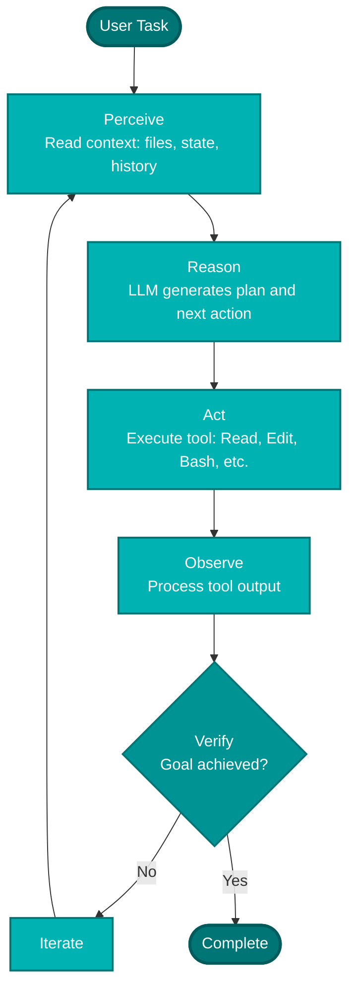
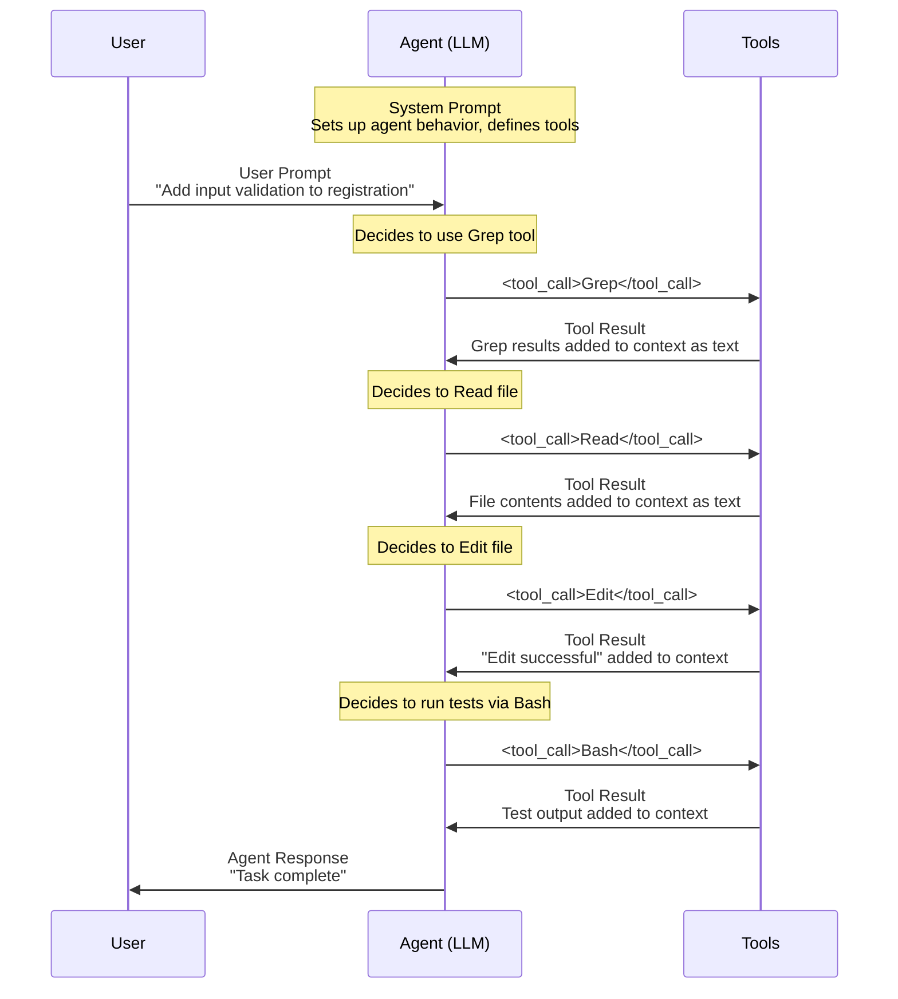

import AbstractShapesVisualization from '@site/src/components/VisualElements/AbstractShapesVisualization';

In Lesson 1, we established that **LLMs are brains** (token prediction engines) and **agent frameworks are bodies** (execution layers). Now let's understand how these components work together to create autonomous coding agents that can complete complex tasks.

## The Agent Execution Loop

An agent isn't just an LLM responding to prompts. It's a **feedback loop** that combines reasoning with action, allowing the LLM to iteratively work toward a goal.

### Basic Loop: Perceive → Reason → Act → Verify → Iterate



**Key distinction:** A chat interface requires you to manually execute actions between prompts. An agent **autonomously loops** through this cycle.

### Example: Implementing a Feature

**Chat interface workflow:**

1. You: "How should I add authentication to this API?"
2. LLM: "Here's the code..."
3. **You manually edit files**
4. You: "I got this error..."
5. LLM: "Try this fix..."
6. **You manually edit again**

**Agent workflow:**

1. You: "Add authentication to this API"
2. Agent: [Perceive] Reads API files → [Reason] Plans implementation → [Act] Edits files → [Observe] Runs tests → [Verify] Tests fail → [Reason] Analyzes error → [Act] Fixes code → [Observe] Runs tests → [Verify] Tests pass → Done

The agent **closes the loop** automatically, executing the full cycle without requiring manual intervention at each step.

## Under the Hood: It's All Just Text

Here's the fundamental truth that demystifies AI coding agents: **everything is just text flowing through a context window.**

No magic, no separate reasoning engine, no hidden state. When you interact with an agent, you're watching a conversation unfold in a single, large text buffer.

### The Textual Flow

Every agent interaction follows this pattern:



:::tip[Reasoning is Just Text]
The agent doesn't "think" separately from its output. When you see the agent reasoning ("I should check the validation logic..."), that's not internal thought - it's text being generated in the context, visible to both you and the LLM itself.

**Extended thinking modes complicate this further:** Providers like Anthropic and OpenAI now offer "extended thinking" where the model generates hidden reasoning tokens before producing visible output. What you see in the context is a _summary_ of that internal chain-of-thought, not the full reasoning process. You're billed for the complete hidden reasoning tokens, but you only see an abbreviated version. The actual reasoning is opaque - you can't inspect or debug it.
:::

### Concrete Example: What the Context Actually Looks Like

When you ask Claude Code to "Add email validation to the registration endpoint," the context window contains a single, continuous text stream. Here's exactly what flows through the agent's context - system instructions, your task, tool calls, results, and responses all as text:

```
SYSTEM: You are Claude Code, an AI coding assistant. You have access to these tools:
- Read(file_path): Read a file
- Edit(file_path, old_string, new_string): Edit a file
- Bash(command): Run a shell command
- Grep(pattern, path): Search for pattern in files
[... more tool descriptions ...]

USER: Add email validation to the registration endpoint

ASSISTANT: I'll search for the registration endpoint first.
<tool_use>
  <tool_name>Grep</tool_name>
  <parameters>
    <pattern>register</pattern>
    <glob>**/*.ts</glob>
  </parameters>
</tool_use>

TOOL_RESULT: Found in:
- src/routes/auth.ts:12: router.post('/register', userHandler.register)
- src/handlers/user.ts:45: export async function register(req, res) {

ASSISTANT: Found the endpoint. Let me read the handler to see current validation.
<tool_use>
  <tool_name>Read</tool_name>
  <parameters>
    <file_path>src/handlers/user.ts</file_path>
  </parameters>
</tool_use>

TOOL_RESULT: [file contents showing no email validation]

ASSISTANT: No validation present. I'll add email validation using Zod.
<tool_use>
  <tool_name>Edit</tool_name>
  <parameters>
    <file_path>src/handlers/user.ts</file_path>
    <old_string>export async function register(req, res) {
  const { email, password } = req.body;
  await db.users.create({ email, password });</old_string>
    <new_string>const registerSchema = z.object({
  email: z.string().email(),
  password: z.string().min(8)
});

export async function register(req, res) {
  const { email, password } = registerSchema.parse(req.body);
  await db.users.create({ email, password });</new_string>
  </parameters>
</tool_use>

TOOL_RESULT: Edit successful

ASSISTANT: Validation added. Running tests to verify.
<tool_use>
  <tool_name>Bash</tool_name>
  <parameters>
    <command>npm test user.test.ts</command>
  </parameters>
</tool_use>

TOOL_RESULT: PASS src/handlers/user.test.ts
  ✓ rejects invalid email (12ms)
  ✓ rejects short password (8ms)

ASSISTANT: Email validation successfully added to the registration endpoint.
```

This entire conversation - system instructions, your task, tool calls, results, and responses - exists as **one continuous text stream** in the LLM's context window.

### Why This Matters

Understanding the textual nature of agents helps you:

1. **Anticipate behavior** - The agent only knows what's in the context
2. **Debug confusion** - If the agent forgets something, it probably scrolled out of context
3. **Structure better prompts** - You're adding text to a conversation, not issuing commands
4. **Recognize limitations** - Context windows are finite; complex tasks may lose details

### The Stateless Advantage

Here's a crucial insight that transforms how you work with AI coding agents: **The LLM is completely stateless.** Its only "world" is the current context window.

The LLM doesn't "remember" previous conversations. It has no hidden internal state. Each response is generated solely from the text currently in the context. When the conversation continues, the LLM sees its previous responses as text in the context, not as memories it recalls.

**This is a massive advantage, not a limitation.** You control what the agent knows by controlling what's in the context.

**Clean-slate exploration:** Start a new conversation, and the agent has no bias from previous decisions. Ask it to implement authentication with JWT in one context, sessions in another - each gets evaluated on merit without defending earlier choices.

**Unbiased code review:** The agent can critically audit its own work. Don't reveal code authorship, and it applies full scrutiny with no defensive bias.

<AbstractShapesVisualization />

The same code that gets "looks sound overall" in one context triggers "Critical security vulnerabilities: localStorage exposes tokens to XSS attacks" in a fresh context. This enables Generate → Review → Iterate workflows where the agent writes code then objectively audits it, or multi-perspective analysis (security review in one context, performance in another).

**How you engineer context determines agent behavior.** This manipulation happens through tools - the mechanisms agents use to read files, run commands, and observe results.

## Tools: Built-In vs External

Agents become useful through **tools** - functions the LLM can call to interact with the world.

### Built-In Tools: Optimized for Speed

CLI coding agents ship with purpose-built tools for common workflows:

**Read, Edit, Bash, Grep, Write, Glob** - These aren't just wrappers around shell commands. They're engineered with edge case handling, LLM-friendly output formats, safety guardrails, and token efficiency.

### External Tools: MCP Protocol

**MCP (Model Context Protocol)** is a standardized plugin system for adding custom tools. Use it to connect your agent to external systems:

- Database clients (Postgres, MongoDB)
- API integrations (Stripe, GitHub, Figma)
- Cloud platforms (AWS, GCP, Azure)

Configure MCP servers in your settings, and the agent discovers their tools at runtime:

```json
// ~/.claude/mcp_settings.json
{
  "servers": {
    "postgres": {
      "command": "npx",
      "args": [
        "@modelcontextprotocol/server-postgres",
        "postgresql://localhost/mydb"
      ]
    }
  }
}
```

## CLI Coding Agents: Why They Win

While chat interfaces (ChatGPT, Copilot Chat) excel at answering questions and brainstorming, **CLI coding agents deliver superior developer experience** for actual implementation work.

### The Concurrent Work Advantage

**Multiple terminal tabs = multiple agents working on different projects simultaneously.**

Open three tabs, run agents on different projects (refactoring in `project-a`, debugging in `project-b`, implementing in `project-c`). Context-switch freely. Each agent keeps working independently.

**IDE agents (Cursor, Copilot)** are tightly coupled to a single window and project. You're blocked until the agent completes or you cancel and lose context.

**Chat interfaces** reset context with each conversation. You manually copy-paste code and execute changes.

**CLI agents unlock parallelism** without managing conversation threads or multiple IDE instances.

:::tip Preview: Lesson 7
We'll dive deep into **Planning & Execution** strategies in Lesson 7, including how to structure concurrent work across multiple agents, when to parallelize vs. serialize tasks, and how to coordinate complex multi-project workflows.
:::

## Context Engineering and Steering

Now that you understand agents as textual systems and LLMs as stateless, the core truth emerges: **effective AI-assisted coding is about engineering context to steer behavior**. The context window is the agent's entire world - everything it knows comes from the text flowing through it. You control that text: system prompts, your instructions, tool results, conversation history. Vague context produces wandering behavior; precise, scoped context steers the agent exactly where you need it. You can steer upfront with focused prompts, or dynamically mid-conversation when the agent drifts. The stateless nature means you can even steer the agent to objectively review its own code in a fresh conversation.

This is system design thinking applied to text - you're already good at designing interfaces and contracts. The rest of this course teaches how to apply those skills to engineer context and steer agents across real coding scenarios.

---

**Next:** [Lesson 3: High-Level Methodology](../methodology/lesson-3-high-level-methodology.md)
