import CompoundQualityVisualization from '@site/src/components/VisualElements/CompoundQualityVisualization';

Agents amplify patterns—good or bad. Clean code generates more clean code. Scattered logic generates more scattered logic. Research confirms this: AI-generated code contains **8x more duplicated blocks** than human-written code[^1]. Agents don't create duplication—they amplify existing patterns they observe during code research.

**Critical caveat:** Even with perfect patterns, agents are stochastic systems—LLM token generation is probabilistic, not deterministic. Confabulations, hallucinations, and subtle errors occur randomly, regardless of pattern quality. High entropy states (complex refactors, cross-cutting changes) increase error probability. Your job isn't to prevent all errors—that's impossible with probabilistic systems—it's to **actively reject errors during review** to prevent them from entering the compounding cycle.

Every piece of code you accept today becomes pattern context for tomorrow's agents. This creates exponential quality curves—upward or downward. You control the direction.

## The Compounding Mechanism

During code research ([Lesson 5](/docs/methodology/lesson-5-grounding)), agents grep for patterns, read implementations, and load examples into context. The code they find becomes the pattern context for generation.

<CompoundQualityVisualization />

### Two Sources of Quality Drift

Your code quality degrades in two fundamentally different ways when working with AI:

**1. The Copy Machine Effect (Predictable Amplification)**

Agents find existing code and use it as examples. If your codebase has duplication, the agent learns "this is how we do things here" and creates more duplication. If tests are missing in similar files, the agent generates code without tests. If error handling is inconsistent, the agent produces inconsistent error handling.

This is predictable: show the agent messy patterns, get messy code back. The agent isn't being creative—it's pattern-matching what already exists.

**2. The Dice Roll (Random AI Errors)**

LLMs are probabilistic systems—they generate code through weighted randomness, not logical reasoning. Even when your codebase is pristine, the AI randomly produces errors:

- **Making things up:** References a `getUserProfile()` function that doesn't exist, imports from files that aren't there
- **Complexity breaks down:** Simple tasks work fine, but multi-file refactors or complex state management increase the chance of mistakes
- **Model quirks:** Different model versions, context limits, and attention patterns create unpredictable variance

You can't eliminate these random errors with better prompts or cleaner patterns—they're inherent to how LLMs work.

**Why This Matters:**

Both problems feed the same exponential curve. When you accept a random AI error during code review, it becomes a pattern that gets copied. One hallucinated API call in iteration 1 becomes the template for 5 similar hallucinations by iteration 3.

**Your Critical Role:** Code review ([Lesson 9](/docs/practical-techniques/lesson-9-reviewing-code)) is where you break the cycle. Reject bad patterns before they multiply. Reject random errors before they become patterns. Every acceptance decision affects every future generation.

## Co-locate Related Constraints

From [Lesson 5](/docs/methodology/lesson-5-grounding), agents discover your codebase through **agentic search**—Grep, Read, Glob. **Agents only see code they explicitly find.** When constraints scatter across files, search determines what the agent sees and what it misses.

**Anti-pattern (scattered constraints):**

```typescript
// File: services/auth.ts
function createUser(email: string, password: string) {
  return db.users.insert({ email, password: hashPassword(password) })
}

// File: config/validation.ts
const MIN_PASSWORD_LENGTH = 12  // ← Agent never searches for this file
```

**What happens:** Agent searches `Grep("createUser")` → reads `services/auth.ts` → generates code accepting 3-character passwords because it never saw `MIN_PASSWORD_LENGTH`.

**Production pattern (co-located constraints):**

```typescript
// File: services/auth.ts
const MIN_PASSWORD_LENGTH = 12  // ← Agent sees this in same file

function createUser(email: string, password: string) {
  if (password.length < MIN_PASSWORD_LENGTH) {
    throw new Error(`Password must be at least ${MIN_PASSWORD_LENGTH} characters`)
  }
  return db.users.insert({ email, password: hashPassword(password) })
}
```

**What happens:** Agent searches `Grep("createUser")` → reads `services/auth.ts` → sees `MIN_PASSWORD_LENGTH` in same read → generates code that enforces constraint.

### Semantic Bridges When DRY Requires Separation

When constraints must be shared across modules, create **semantic bridges**—comments with related semantic keywords enabling semantic search and code research tools ([Lesson 5](/docs/methodology/lesson-5-grounding#solution-1-semantic-search)) to discover relationships:

```typescript
// File: shared/constants.ts
// Password strength requirements: minimum character length enforcement
export const MIN_PASSWORD_LENGTH = 12

// File: services/auth.ts
import { MIN_PASSWORD_LENGTH } from '@/shared/constants'

// User credential validation: enforce security constraints
function createUser(email: string, password: string) {
  return db.users.insert({ email, password: hashPassword(password) })
}
```

**How semantic bridges work:** Semantic search matches meaning, not exact words. Query "password validation requirements" finds BOTH files because embeddings recognize semantic similarity:
- "password" ≈ "credential"
- "requirements" ≈ "constraints"
- "strength" ≈ "security"

The comments use different words with overlapping meaning—semantic breadcrumbs that connect related concepts across files.

### Automate Through Prompting

Rather than manually managing discoverability strategies, configure your agent to handle this automatically. Add instructions like `"Document inline when necessary"` and `"Match surrounding patterns and style"` to your `CLAUDE.md` or `AGENTS.md` ([Lesson 6](/docs/practical-techniques/lesson-6-project-onboarding)). These phrases make agents automatically add semantic bridge comments during generation, follow existing code conventions, and maintain consistency without explicit oversight. The agent reads your co-located constraints and semantic bridges during code research, then generates new code that follows the same patterns—turning discoverability into a self-reinforcing system rather than manual organizational work.

**Caveat:** You'll need to occasionally remind the agent about these instructions in your task-specific prompts. Due to the [U-shaped attention curve](/docs/methodology/lesson-5-grounding#the-scale-problem-context-window-limits), instructions buried in configuration files can fall into the ignored middle of the context window during long interactions. A quick reminder like "document inline where necessary and match surrounding style" at the end of your prompt ensures these constraints stay in the high-attention zone.

## Comments as Context Engineering: Critical Sections for Agents

**Advanced technique—use sparingly.** In concurrent programming, critical sections protect shared resources through mutual exclusion. Comments can serve a similar role for AI agents, creating "agent-critical sections" that guard sensitive code from accidental modification. Apply this **only** to genuinely high-risk code: authentication/authorization, cryptographic operations, payment processing, database migrations, audit logging, PII handling. Do NOT use for general business logic, CRUD operations, or frequently-changing code. The trade-off: protection creates friction. If every function has "CRITICAL" warnings, the signal becomes noise and legitimate agent work slows down.

When agents research your codebase ([Lesson 5](/docs/methodology/lesson-5-grounding)), they read files and load every comment into their context window. This means comments become prompts. Write them like prompts using techniques from [Lesson 4](/docs/methodology/lesson-4-prompting-101): imperative directives (NEVER, MUST, ALWAYS), explicit negation patterns ("Do NOT X. Instead, always Y"), numbered steps for complex operations (Step 1, Step 2), and concrete consequences. When the agent generates password handling code and reads "NEVER store passwords in plain text" with implementation alternatives, that violation becomes far less likely. You're exploiting prompt injection—the good kind.

```typescript
// Standard comment
// Validates password before storing
function createUser(password: string) {
  return db.users.insert({ password })
}

// Critical section (agent barrier)
// === CRITICAL SECURITY SECTION ===
// C-001: NEVER store passwords in plain text or weak hashing (MD5, SHA1)
// MUST hash with bcrypt (10+ rounds) BEFORE persistence
// Do NOT modify hashing algorithm without security review
// Violations create CVE-level vulnerabilities
function createUser(password: string) {
  if (password.length < 12) {
    throw new Error('Password must be at least 12 characters')
  }
  const hashed = bcrypt.hashSync(password, 10)
  return db.users.insert({ password: hashed })
}
```

This creates deliberate friction. An agent tasked with "add OAuth login" will work slower around password hashing code with heavy constraints—it must navigate all those NEVER/MUST directives carefully. That's the protection mechanism: forced caution for critical paths. But overuse is counterproductive. Mark too many functions as CRITICAL and agents struggle with routine work, slowing down legitimate changes as much as dangerous ones. Reserve this technique for code where accidental modification genuinely costs more than the development slowdown.

These constraint IDs (C-001, I-001) originate in [spec tables](/docs/practical-techniques/lesson-13-systems-thinking-specs#constraints-and-invariants-defining-correctness) and migrate into code during implementation. Once inlined, the code carries the constraint—not just the implementation, but the *rule* it enforces. This is what makes it safe to [delete the spec](/docs/practical-techniques/lesson-12-spec-driven-development) after implementation: the WHY has migrated into the codebase.

## The Knowledge Cache Anti-Pattern

You've extracted architectural knowledge from your codebase with an agent—clean diagrams, comprehensive API documentation, detailed component relationships. You save it as `ARCHITECTURE.md` and commit it. Now you have a cache invalidation problem: code changes (always), documentation doesn't (usually), and future agents find both during code research ([Lesson 5](/docs/methodology/lesson-5-grounding)). The diagram below shows the divergence.

```mermaid
sequenceDiagram
    participant KB as 🗄️ Codebase<br/>(Persistent)
    participant Agent as ⚡ Agent<br/>(Stateless)

    rect rgb(147, 142, 235, 0.1)
        Note over Agent: 1. RESEARCH
        Agent->>KB: Read source code
        KB->>Agent: Knowledge extracted
    end

    alt ✅ Good Path
        Note over Agent: Knowledge stays in context
        rect rgb(147, 142, 235, 0.1)
            Note over Agent: 2. PLAN
            Note over Agent: 3. EXECUTE
            Agent->>KB: Edit code
            Note over KB: Code changes
        end
        Note over Agent: Done ✓
        Note over KB: Code = source of truth
    else ❌ Bad Path: Cache Research
        Agent->>KB: Save ARCHITECTURE.md
        Note over KB: Cache committed
        rect rgb(147, 142, 235, 0.1)
            Note over Agent: 2. PLAN
            Note over Agent: 3. EXECUTE
            Agent->>KB: Edit code
            Note over KB: Code changes<br/>⚠️ Cache now stale!
        end

        Note over Agent: Future agent spawns
        Agent->>KB: Research (read KB)
        KB->>Agent: Finds BOTH:<br/>① Current code<br/>② Outdated cache
        Note over Agent: Confusion!
    end
```



The moment you commit extracted knowledge, every code change requires documentation updates you'll forget. Source code is your single source of truth—code research tools (ChunkHound, semantic search, Explore) extract architectural knowledge dynamically every time, fresh and accurate. The distinction: **HOW** knowledge (implementation details, data flows, component relationships) is redundant with code—code research regenerates it on demand. **WHY** knowledge (rejected alternatives, business rationale, compliance mandates) can't be expressed in code. Commit the WHY as decision records—short documents capturing what was decided, why, and what alternatives were rejected. Let code research handle the HOW.

## Key Takeaways

- **Agents amplify patterns AND produce stochastic errors** - Good patterns compound into better code. Bad patterns compound into technical debt. **But even with perfect patterns, LLMs produce probabilistic errors** (confabulations, entropy-driven failures) that compound if accepted. Research shows AI code has 8x more duplication because agents amplify existing duplication patterns. Every accepted PR becomes pattern context for future agents—including any stochastic errors you failed to reject.

- **Co-locate constraints, create semantic bridges when necessary** - Scattered code compounds into harder-to-navigate codebases. When separation is required (DRY), use explicit comments pointing to related files.

- **Comments as agent-critical sections (use sparingly)** - For genuinely high-risk code (authentication, cryptography, payments, PII), write comments as prompts using imperative directives (NEVER, MUST, ALWAYS) to create deliberate friction. This protection mechanism guards sensitive code from accidental modification. **Overuse is counterproductive**—if everything is marked CRITICAL, the signal becomes noise and legitimate work slows down.

- **Constraint IDs migrate from spec to code** — When specs use IDs like C-001 or I-001 ([Lesson 13](/docs/practical-techniques/lesson-13-systems-thinking-specs#constraints-and-invariants-defining-correctness)), agents inline them into code comments during implementation. The code then carries the constraint rule, making it safe to delete the spec ([Lesson 12](/docs/practical-techniques/lesson-12-spec-driven-development)).

- **You are the quality circuit breaker** - Code review ([Lesson 9](/docs/practical-techniques/lesson-9-reviewing-code)) prevents negative compounding. Accepting bad patterns lets them enter pattern context for future agents. Rejecting them breaks the negative feedback loop.

- **Avoid knowledge cache anti-patterns** - Code research tools (Explore, ChunkHound, semantic search) extract architectural knowledge dynamically from source code every time you need it. Saving extracted knowledge to .md files creates unnecessary caches that become stale, pollute future grounding with duplicated information, and create impossible cache invalidation problems. Trust the grounding process ([Lesson 5](/docs/methodology/lesson-5-grounding)) to re-extract knowledge on-demand from the single source of truth.

---

[^1]: GitClear (2025) - Analysis of 211 million lines of code (2020-2024) showing 8-fold increase in duplicated code blocks in AI-generated code. Source: [LeadDev: How AI-generated code accelerates technical debt](https://leaddev.com/technical-direction/how-ai-generated-code-accelerates-technical-debt)
