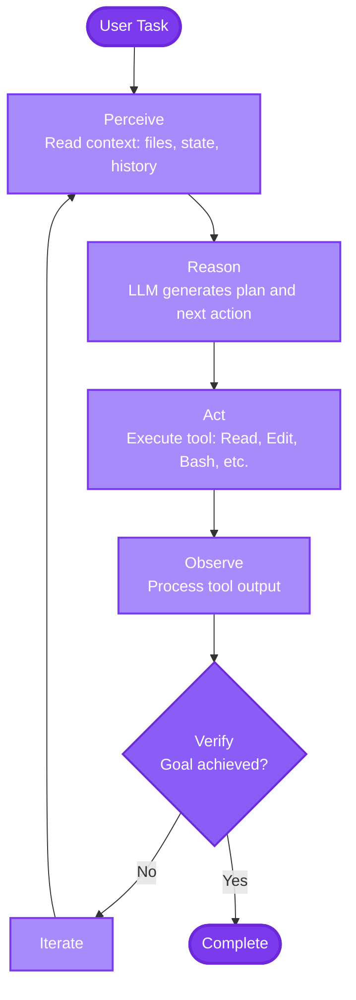
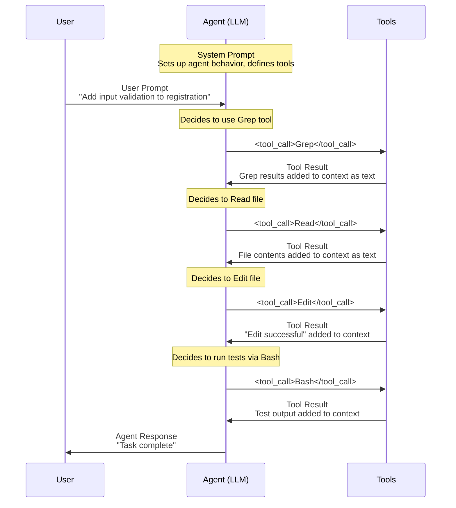

# Understanding Agents

In Lesson 1, we established that **LLMs are brains** (token prediction engines) and **agent frameworks are bodies** (execution layers). Now let's understand how these components work together to create autonomous coding agents that can complete complex tasks.

## Learning Objectives

By the end of this lesson, you will be able to:

- Explain how agents work as textual systems (system prompts → user tasks → tool calls → results → responses)
- Distinguish between built-in tools and MCP-based external tools and when to use each
- Understand why CLI coding agents deliver superior developer experience, especially for concurrent work across projects
- Recognize context engineering as the fundamental skill for effective AI-assisted coding

## The Agent Execution Loop

An agent isn't just an LLM responding to prompts. It's a **feedback loop** that combines reasoning with action, allowing the LLM to iteratively work toward a goal.

### Basic Loop: Perceive → Reason → Act → Verify → Iterate



**Key distinction:** A chat interface requires you to manually execute actions between prompts. An agent **autonomously loops** through this cycle.

### Example: Implementing a Feature

**Chat interface workflow:**

1. You: "How should I add authentication to this API?"
2. LLM: "Here's the code..."
3. **You manually edit files**
4. You: "I got this error..."
5. LLM: "Try this fix..."
6. **You manually edit again**

**Agent workflow:**

1. You: "Add authentication to this API"
2. Agent: [Perceive] Reads API files → [Reason] Plans implementation → [Act] Edits files → [Observe] Runs tests → [Verify] Tests fail → [Reason] Analyzes error → [Act] Fixes code → [Observe] Runs tests → [Verify] Tests pass → Done

The agent **closes the loop** automatically, executing the full cycle without requiring manual intervention at each step.

## Under the Hood: It's All Just Text

Here's the fundamental truth that demystifies AI coding agents: **everything is just text flowing through a context window.**

No magic, no separate reasoning engine, no hidden state. When you interact with an agent, you're watching a conversation unfold in a single, large text buffer.

### The Textual Flow

Every agent interaction follows this pattern:



**Key insight:** The agent doesn't "think" separately from its output. When you see the agent reasoning ("I should check the validation logic..."), that's not internal thought - it's text being generated in the context, visible to both you and the LLM itself.

### Concrete Example: What the Context Actually Looks Like

When you ask Claude Code to "Add email validation to the registration endpoint," the context window contains a single, continuous text stream. Here's exactly what flows through the agent's context - system instructions, your task, tool calls, results, and responses all as text:

```
SYSTEM: You are Claude Code, an AI coding assistant. You have access to these tools:
- Read(file_path): Read a file
- Edit(file_path, old_string, new_string): Edit a file
- Bash(command): Run a shell command
- Grep(pattern, path): Search for pattern in files
[... more tool descriptions ...]

USER: Add email validation to the registration endpoint

ASSISTANT: I'll search for the registration endpoint first.
<tool_use>
  <tool_name>Grep</tool_name>
  <parameters>
    <pattern>register</pattern>
    <glob>**/*.ts</glob>
  </parameters>
</tool_use>

TOOL_RESULT: Found in:
- src/routes/auth.ts:12: router.post('/register', userHandler.register)
- src/handlers/user.ts:45: export async function register(req, res) {

ASSISTANT: Found the endpoint. Let me read the handler to see current validation.
<tool_use>
  <tool_name>Read</tool_name>
  <parameters>
    <file_path>src/handlers/user.ts</file_path>
  </parameters>
</tool_use>

TOOL_RESULT: [file contents showing no email validation]

ASSISTANT: No validation present. I'll add email validation using Zod.
<tool_use>
  <tool_name>Edit</tool_name>
  <parameters>
    <file_path>src/handlers/user.ts</file_path>
    <old_string>export async function register(req, res) {
  const { email, password } = req.body;
  await db.users.create({ email, password });</old_string>
    <new_string>const registerSchema = z.object({
  email: z.string().email(),
  password: z.string().min(8)
});

export async function register(req, res) {
  const { email, password } = registerSchema.parse(req.body);
  await db.users.create({ email, password });</new_string>
  </parameters>
</tool_use>

TOOL_RESULT: Edit successful

ASSISTANT: Validation added. Running tests to verify.
<tool_use>
  <tool_name>Bash</tool_name>
  <parameters>
    <command>npm test user.test.ts</command>
  </parameters>
</tool_use>

TOOL_RESULT: PASS src/handlers/user.test.ts
  ✓ rejects invalid email (12ms)
  ✓ rejects short password (8ms)

ASSISTANT: Email validation successfully added to the registration endpoint.
```

This entire conversation - system instructions, your task, tool calls, results, and responses - exists as **one continuous text stream** in the LLM's context window.

### Why This Matters

Understanding the textual nature of agents helps you:

1. **Anticipate behavior** - The agent only knows what's in the context
2. **Debug confusion** - If the agent forgets something, it probably scrolled out of context
3. **Structure better prompts** - You're adding text to a conversation, not issuing commands
4. **Recognize limitations** - Context windows are finite; complex tasks may lose details

### The Stateless Advantage

Here's a crucial insight that transforms how you work with AI coding agents: **The LLM is completely stateless.** Its only "world" is the current context window.

The LLM doesn't "remember" previous conversations. It has no hidden internal state. Each response is generated solely from the text currently in the context. When the conversation continues, the LLM sees its previous responses as text in the context, not as memories it recalls.

**This is a massive advantage, not a limitation.**

**Advantage 1: Total control over agent "memory"**

You decide what the agent knows by controlling what's in the context:

```
# First conversation
You: "Implement user authentication using JWT"
Agent: [Implements auth with JWT, stores tokens in localStorage]

# Later, new conversation (fresh context)
You: "Implement user authentication using sessions"
Agent: [Implements auth with sessions, no JWT bias]
```

The agent doesn't carry baggage from previous decisions. Each conversation is a clean slate. You can explore alternative approaches without the agent defending its earlier choices.

**Advantage 2: Unbiased verification**

The agent can review its own work with fresh eyes:

```
# Step 1: Implementation
You: "Add email validation to registration endpoint"
Agent: [Writes validation code]

# Step 2: Verification (agent doesn't "remember" writing this)
You: "Review the validation logic in src/handlers/user.ts for security issues"
Agent: [Analyzes code objectively, finds potential regex DoS vulnerability]
```

**The agent doesn't know it wrote that code** unless you tell it. It reviews the code as objectively as if someone else wrote it. No ego, no defensive justification of past decisions.

This enables powerful workflows:

- **Generate → Review → Iterate** - Agent writes code, then critically reviews it
- **Multi-perspective analysis** - Ask for security review in one context, performance review in another
- **A/B testing approaches** - Explore different implementations without cross-contamination

**Production implication:** Design your prompts to control what context the agent sees. Want unbiased code review? Don't tell it who wrote the code. Want it to follow existing patterns? Include examples in the context. The agent's "knowledge" is entirely what you engineer into the conversation.

## Tools: Built-In vs External

Agents become useful through **tools** - functions the LLM can call to interact with the world.

### Built-In Tools: Optimized for Speed

CLI coding agents ship with purpose-built tools for common workflows:

**Read, Edit, Bash, Grep, Write, Glob** - These aren't just wrappers around shell commands. They're engineered with edge case handling, LLM-friendly output formats, safety guardrails, and token efficiency.

### External Tools: MCP Protocol

**MCP (Model Context Protocol)** is a standardized plugin system for adding custom tools. Use it to connect your agent to external systems:

- Database clients (Postgres, MongoDB)
- API integrations (Stripe, GitHub, Figma)
- Cloud platforms (AWS, GCP, Azure)

Configure MCP servers in your settings, and the agent discovers their tools at runtime:

```json
// ~/.claude/mcp_settings.json
{
  "servers": {
    "postgres": {
      "command": "npx",
      "args": [
        "@modelcontextprotocol/server-postgres",
        "postgresql://localhost/mydb"
      ]
    }
  }
}
```

## CLI Coding Agents: Why They Win

While chat interfaces (ChatGPT, Copilot Chat) excel at answering questions and brainstorming, **CLI coding agents deliver superior developer experience** for actual implementation work.

### The Concurrent Work Advantage

**Multiple terminal tabs = multiple agents working on different projects simultaneously.**

Open three tabs, run agents on different projects (refactoring in `project-a`, debugging in `project-b`, implementing in `project-c`). Context-switch freely. Each agent keeps working independently.

**IDE agents (Cursor, Copilot)** are tightly coupled to a single window and project. You're blocked until the agent completes or you cancel and lose context.

**Chat interfaces** reset context with each conversation. You manually copy-paste code and execute changes.

**CLI agents unlock parallelism** without managing conversation threads or multiple IDE instances.

:::tip Preview: Lesson 7
We'll dive deep into **Planning & Execution** strategies in Lesson 7, including how to structure concurrent work across multiple agents, when to parallelize vs. serialize tasks, and how to coordinate complex multi-project workflows.
:::

## Context Engineering: Optimizing the Entire Flow

Now that you understand agents as **textual systems** and LLMs as **stateless**, you can see why effective AI-assisted coding is fundamentally about **context engineering** - deliberately optimizing every piece of text that flows through the agent's context window.

**Because the LLM is stateless, the context is its entire world.** You have total control over what the agent knows, believes, and can do. This makes context engineering the most powerful skill for AI-assisted coding.

### Everything is Context Engineering

When you work with AI coding agents, you're not just "writing prompts." You're engineering a **complete textual environment** that determines agent behavior:

**1. System Prompts** (set by agent developers)

- Define the agent's role and behavior
- Specify available tools and their usage patterns
- Set safety guardrails and operational constraints
- **You control this** when building custom agents or configuring MCP tools

**2. User Prompts** (your tasks and instructions)

- The goals you give the agent
- Context you provide about the codebase
- Constraints and requirements you specify
- **You control this** every time you interact with the agent

**3. Tool Descriptions** (eat up context tokens)

- Each tool has a description explaining its purpose
- Parameters and expected inputs
- Examples of correct usage
- **Trade-off:** More tools = more capability, but also more context consumed and potential confusion

**4. Tool Results** (returned to context)

- File contents from Read operations
- Search results from Grep
- Command output from Bash
- **Format matters:** Verbose tool output wastes tokens; structured, concise results keep context clean

**5. Agent Responses** (LLM-generated text)

- Reasoning about what to do next
- Tool calls in structured format
- Explanations and status updates
- **Accumulates over time:** Long conversations fill the context window

### Steering: Guiding Behavior Through Context

**Steering** is the practice of guiding LLM behavior by controlling what's in the context. You're not just "asking better" - you're actively directing the agent's attention and approach.

**Vague context = wandering behavior:**

```
User: "Fix the bug"
Agent: [Searches entire codebase, loads 20 files, gets confused, makes random changes]
```

**Specific context = steered behavior:**

```
User: "Fix the authentication bug in src/auth/middleware.ts - tokens are
expiring 1 hour early. The issue is likely in the JWT verification logic
that compares timestamps. Tests are in tests/auth.test.ts"

Agent: [Directly reads the specific file, understands the narrow scope,
makes targeted fix, runs relevant tests]
```

**How you steered:**

- File paths → eliminated search, focused attention
- Precise description → narrowed hypothesis space
- Root cause hypothesis → directed investigation path
- Test location → specified verification method

**Steering through statelessness:**

Because the agent has no memory, you can steer it to review its own code objectively:

```
# Conversation 1: Implementation
You: "Implement rate limiting middleware for our API"
Agent: [Writes code using in-memory store]

# Conversation 2: Fresh context, different steering
You: "Review src/middleware/rateLimit.ts for security and scalability issues"
Agent: [Finds: in-memory store fails in multi-instance deployments, suggests Redis]
```

The agent doesn't defend its earlier choice - it critiques the code as if encountering it for the first time. You steered it from "implementer" to "reviewer" by controlling the context.

### The Rest of This Course

Now you understand the foundation: agents are textual systems, LLMs are stateless, and you control behavior by controlling context.

**Context engineering** is the practice of deliberately shaping what flows through the agent's context window - system prompts, user prompts, tool results, everything. It's the fundamental skill for effective AI-assisted coding.

Every lesson from here forward teaches context engineering techniques for different scenarios.

**The mental model shift:** Stop thinking "I'm asking the AI to do something." Start thinking "I'm steering the agent by engineering its textual environment."

Experienced engineers excel at context engineering because you already think in terms of interfaces, contracts, and system design. This is just applying those skills to the LLM's textual interface.

---

**Next:** [Lesson 3: High-Level Methodology](../methodology/lesson-3-high-level-methodology.md)
