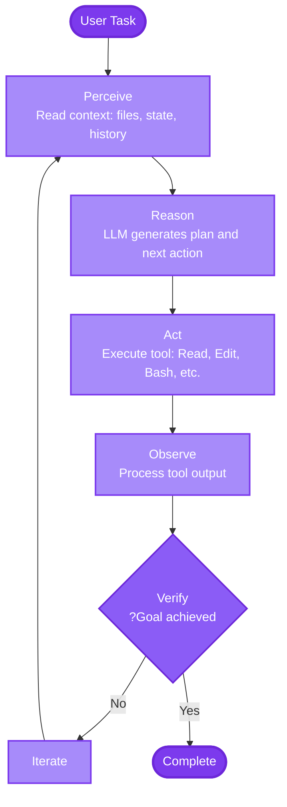
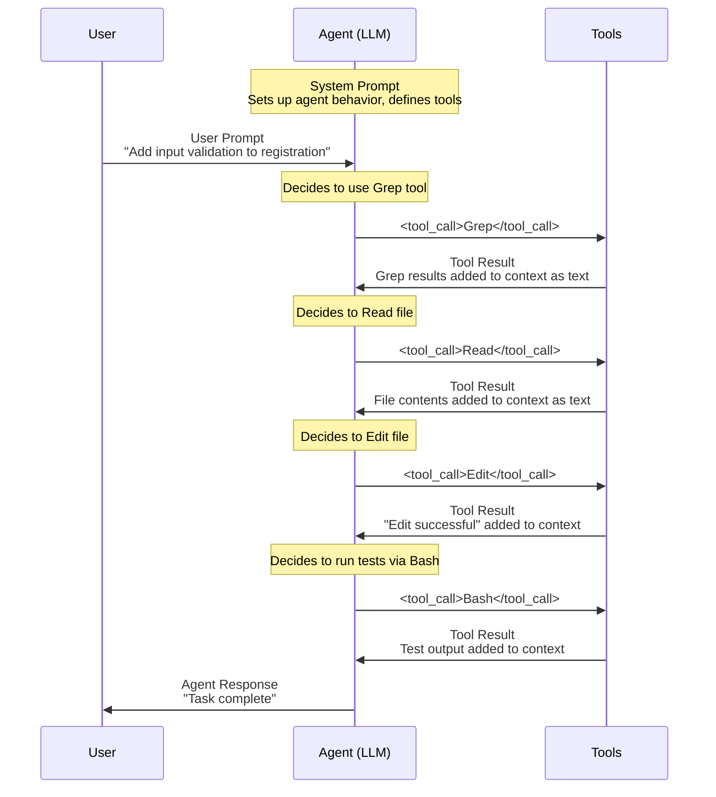

import AbstractShapesVisualization from '@site/src/components/VisualElements/AbstractShapesVisualization';

בשיעור 1, הבססנו ש**LLMs הם מוחות** (מנועי חיזוי טוקנים) ו**frameworks של סוכנים הם גופים** (שכבות ביצוע). עכשיו בואו נבין איך הרכיבים האלה עובדים יחד ליצירת סוכני קידוד אוטונומיים שיכולים להשלים משימות מורכבות.

## לולאת הביצוע של הסוכן

סוכן הוא לא רק LLM שמגיב לפרומפטים. זו **לולאת משוב** שמשלבת הסקה עם פעולה, מאפשרת ל-LLM לעבוד איטרטיבית לעבר מטרה.

### לולאה בסיסית: Perceive → Reason → Act → Verify → Iterate
**להבחין ← לנתח ← לפעול ← לאמת ← לחזור**



**הבחנה מרכזית:** ממשק צ'אט דורש מכם לבצע פעולות ידנית בין פרומפטים. סוכן **רץ בלופ אוטונומי** דרך המחזור הזה.

### דוגמה: יישום פיצ'ר

**תהליך עבודה של ממשק צ'אט:**

1. אתם: "איך אני צריך להוסיף authentication ל-API הזה?"
2. LLM: "הנה הקוד..."
3. **אתם עורכים קבצים ידנית**
4. אתם: "קיבלתי את השגיאה הזו..."
5. LLM: "נסו את התיקון הזה..."
6. **אתם עורכים שוב ידנית**

**תהליך עבודה של סוכן:**

1. אתם: "הוסף authentication ל-API הזה"
2. סוכן: [Perceive] קורא קבצי API קיימים ← [Reason] מתכנן ← [Act] עורך קבצים ← [Observe] מריץ בדיקות ← [Verify] בדיקות נכשלות ← [Reason] מנתח שגיאה ← [Act] מתקן קוד ← [Observe] מריץ בדיקות ← [Verify] בדיקות עוברות ← סיום

הסוכן **סוגר את הלולאה** אוטומטית, מבצע את המחזור המלא ללא צורך בהתערבות ידנית בכל שלב.

## מתחת למכסה: הכל רק טקסט

הנה האמת היסודית שמבהירה מה הם סוכני קידוד AI: **הכל רק טקסט שזורם דרך חלון הקונטקסט (context window).**

ללא קסם, ללא מנוע הסקה נפרד, ללא מצב נסתר. כשאתם מתקשרים עם סוכן, אתם צופים בשיחה שמתגלגלת בבאפר טקסט גדול אחד.

### הזרימה הטקסטואלית

כל אינטראקציה עם סוכן עוקבת אחר התבנית הזו:



:::tip[הסקה היא רק טקסט]
הסוכן לא "חושב" בנפרד מהפלט שלו. כשאתם רואים את הסוכן מסיק ("אני צריך לבדוק את לוגיקת הוולידציה..."), זו לא מחשבה פנימית - זה טקסט שמיוצר בקונטקסט, גלוי גם לכם וגם ל-LLM עצמו.

**מצבי extended thinking מסבכים את זה עוד יותר:** ספקים כמו Anthropic ו-OpenAI מציעים עכשיו "extended thinking" שבו המודל מייצר טוקני הסקה נסתרים לפני שהוא מייצר פלט גלוי. מה שאתם רואים בקונטקסט הוא _סיכום_ של chain-of-thought הפנימי, לא תהליך ההסקה המלא. אתם מחויבים על טוקני ההסקה הנסתרים המלאים, אבל אתם רואים רק גרסה מקוצרת. ההסקה האמיתית היא אטומה - לא ניתן לבחון או לדבג אותה.
:::

### דוגמה קונקרטית: איך הקונטקסט באמת נראה

כשאתם מבקשים מ-Claude Code "להוסיף email validation לקונטרולר של ההרשמה," חלון הקונטקסט מכיל זרם טקסט רציף אחד. הנה בדיוק מה שזורם דרך הקונטקסט של הסוכן - הוראות מערכת, המשימה שלכם, קריאות כלים, תוצאות ותגובות הכל כטקסט:

```
SYSTEM: You are Claude Code, an AI coding assistant. You have access to these tools:
- Read(file_path): Read a file
- Edit(file_path, old_string, new_string): Edit a file
- Bash(command): Run a shell command
- Grep(pattern, path): Search for pattern in files
[... more tool descriptions ...]

USER: Add email validation to the registration endpoint

ASSISTANT: I'll search for the registration endpoint first.
<tool_use>
  <tool_name>Grep</tool_name>
  <parameters>
    <pattern>register</pattern>
    <glob>**/*.ts</glob>
  </parameters>
</tool_use>

TOOL_RESULT: Found in:
- src/routes/auth.ts:12: router.post('/register', userHandler.register)
- src/handlers/user.ts:45: export async function register(req, res) {

ASSISTANT: Found the endpoint. Let me read the handler to see current validation.
<tool_use>
  <tool_name>Read</tool_name>
  <parameters>
    <file_path>src/handlers/user.ts</file_path>
  </parameters>
</tool_use>

TOOL_RESULT: [file contents showing no email validation]

ASSISTANT: No validation present. I'll add email validation using Zod.
<tool_use>
  <tool_name>Edit</tool_name>
  <parameters>
    <file_path>src/handlers/user.ts</file_path>
    <old_string>export async function register(req, res) {
  const { email, password } = req.body;
  await db.users.create({ email, password });</old_string>
    <new_string>const registerSchema = z.object({
  email: z.string().email(),
  password: z.string().min(8)
});

export async function register(req, res) {
  const { email, password } = registerSchema.parse(req.body);
  await db.users.create({ email, password });</new_string>
  </parameters>
</tool_use>

TOOL_RESULT: Edit successful

ASSISTANT: Validation added. Running tests to verify.
<tool_use>
  <tool_name>Bash</tool_name>
  <parameters>
    <command>npm test user.test.ts</command>
  </parameters>
</tool_use>

TOOL_RESULT: PASS src/handlers/user.test.ts
  ✓ rejects invalid email (12ms)
  ✓ rejects short password (8ms)

ASSISTANT: Email validation successfully added to the registration endpoint.
```

השיחה הזו בשלמותה - הוראות מערכת, המשימה שלכם, קריאות כלים, תוצאות ותגובות - קיימת כ**זרם טקסט רציף אחד** בחלון הקונטקסט של ה-LLM.

### למה זה חשוב

הבנת הטבע הטקסטואלי של סוכנים עוזרת לכם:

1. **לצפות התנהגות** - הסוכן יודע רק מה שבקונטקסט
2. **לדבג בלבול** - אם הסוכן שוכח משהו, זה כנראה כי זה נגלל מחוץ לקונטקסט
3. **לבנות פרומפטים טובים יותר** - אתם מוסיפים טקסט לשיחה, לא מוציאים פקודות
4. **לזהות מגבלות** - חלונות קונטקסט סופיים; משימות מורכבות עלולות לאבד פרטים

### היתרון של סטייטלס (Stateless)

הנה תובנה קריטית שמשנה איך אתם עובדים עם סוכני קידוד AI: **ה-LLM הוא לחלוטין סטייטלס.** ה"עולם" היחיד שלו הוא חלון הקונטקסט הנוכחי.

ה-LLM לא "זוכר" שיחות קודמות. אין לו סטייט (state) פנימי נסתר. כל תגובה מיוצרת אך ורק מהטקסט שנמצא כרגע בקונטקסט. כשהשיחה ממשיכה, ה-LLM רואה את התגובות הקודמות שלו כטקסט בקונטקסט, לא כזיכרונות שהוא נזכר בהם.

**זה יתרון עצום, לא מגבלה.** אתם שולטים במה הסוכן יודע על ידי שליטה במה שבקונטקסט.

**חקירה מדף נקי:** התחילו שיחה חדשה, ולסוכן אין הטיה (bias) מהחלטות קודמות. בקשו ממנו לממש authentication עם JWT בקונטקסט אחד, sessions באחר - כל גישה נבחנת לגופה ללא צורך להגן על בחירות קודמות.

**Code review ללא הטיה:** הסוכן יכול לבקר באופן ביקורתי את העבודה של עצמו. אל תגלו מי כתב את הקוד, והוא יבחן אותו בקפדנות מלאה ללא bias הגנתי.

<AbstractShapesVisualization />

אותו קוד שמקבל "נראה בסדר בכללי" בקונטקסט אחד מפעיל "בעיות אבטחה קריטיות: localStorage חושף טוקנים להתקפות XSS" בקונטקסט טרי. זה מאפשר workflows של Generate → Review → Iterate שבהן הסוכן כותב קוד ואז בודק אותו באופן אובייקטיבי, או ניתוח רב-פרספקטיבי (סקירת אבטחה בקונטקסט אחד, ביצועים באחר).

**איך אתם מהנדסים קונטקסט קובע את התנהגות הסוכן.** מניפולציה זו קורית דרך "כלים" - המנגנונים שסוכנים משתמשים בהם כדי לקרוא קבצים, להריץ פקודות ולצפות בתוצאות.

## כלים: מובנים מול חיצוניים

סוכנים הופכים שימושיים דרך **כלים (tools)** - פונקציות שה-LLM יכול לקרוא להן כדי לתקשר עם העולם.

### כלים מובנים: ממוטבים למהירות

סוכני קידוד CLI מגיעים עם כלים שנבנו במיוחד לתהליכי עבודה נפוצים:

**Read, Edit, Bash, Grep, Write, Glob** - אלה לא רק wrappers סביב פקודות shell. הם מהונדסים עם טיפול במקרי קצה, פורמטי פלט ידידותיים-ל-LLM, מעקות בטיחות ויעילות טוקנים.

### כלים חיצוניים: פרוטוקול MCP

**MCP (Model Context Protocol)** הוא מערכת plugins סטנדרטית להוספת כלים מותאמים. השתמשו בו כדי לחבר את הסוכן שלכם למערכות חיצוניות:

- לקוחות מסדי נתונים (Postgres, MongoDB)
- אינטגרציות API (Stripe, GitHub, Figma)
- פלטפורמות ענן (AWS, GCP, Azure)

הגדירו שרתי MCP בהגדרות שלכם, והסוכן מגלה את הtools שלהם בזמן ריצה:

```json
// ~/.claude/mcp_settings.json
{
  "servers": {
    "postgres": {
      "command": "npx",
      "args": [
        "@modelcontextprotocol/server-postgres",
        "postgresql://localhost/mydb"
      ]
    }
  }
}
```

## סוכני קידוד CLI: למה הם מנצחים

בעוד ממשקי צ'אט (ChatGPT, Copilot Chat) מצטיינים בתשובות לשאלות וסיעור מוחות, **סוכני קידוד CLI מספקים חוויית מפתח עדיפה** לעבודת מימוש בפועל.

### יתרון העבודה במקביל

**מספר לשוניות בטרמינל = מספר סוכנים שעובדים על פרויקטים שונים בו-זמנית.**

פתחו שלושה tabs, הריצו סוכנים על פרויקטים שונים (refactoring ב-`project-a`, debugging ב-`project-b`, implementing ב-`project-c`). עשו context-switch בחופשיות. כל סוכן ממשיך לעבוד באופן עצמאי.

**סוכני IDE כמו Cursor, Copilot** צמודים היטב לחלון בודד ופרויקט בודד. אתם חסומים עד שהסוכן מסיים או שאתם מבטלים ומאבדים קונטקסט.

**ממשקי צ'אט** מאפסים קונטקסט עם כל שיחה. אתם מעתיקים-מדביקים קוד ידנית ומבצעים שינויים.

**סוכני CLI מאפשרים מיקבול (parallelism)** ללא ניהול threads שיחה או instances של IDE מרובים.

:::tip תצוגה מקדימה: שיעור 7
נצלול לעומק לאסטרטגיות **תכנון וביצוע** בשיעור 7, כולל איך לבנות עבודה במקביל על פני מספר סוכנים, מתי למקבל ומתי לעבוד בטור, ואיך לתאם תהליכי עבודה מורכבים על פני מספר פרויקטים.
:::

## Context Engineering ו-Steering

עכשיו שאתם מבינים סוכנים כמערכות טקסטואליות ו-LLMs כסטֶייטלס, האמת המרכזית עולה: **קידוד יעיל בסיוע AI הוא על הנדסת קונטקסט כדי לנווט התנהגות**. חלון הקונטקסט הוא כל-העולם-כולו של הסוכן - כל מה שהוא יודע מגיע מהטקסט שזורם דרכו. אתם שולטים בטקסט הזה: פרומפטי system, ההוראות שלכם, תוצאות ריצה של כלים, היסטוריית שיחה. קונטקסט מעורפל מייצר התנהגות משוטטת; קונטקסט מדויק וממוקד מנווט את הסוכן בדיוק לאן שאתם צריכים. אתם יכולים לנווט מראש עם פרומפטים ממוקדים, או דינמית באמצע-שיחה כשהסוכן סוטה. הטבע הסטֶייטלסי אומר שאתם יכולים אפילו לנווט את הסוכן לסקור באופן אובייקטיבי את הקוד שלו עצמו בשיחה טרייה.

זו חשיבת system design מיושמת לטקסט - אתם כבר טובים בעיצוב ממשקים וחוזים (contracts). שאר הקורס הזה מלמד איך ליישם את הכישורים האלה להנדסת קונטקסט ולניווט של סוכנים על פני תרחישי קידוד אמיתיים.

---

**הבא:** [שיעור 3: מתודולוגיה כללית](../methodology/lesson-3-high-level-methodology.md)
