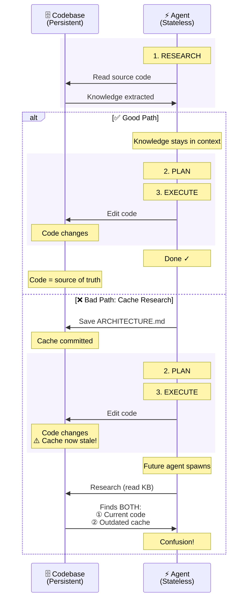

import CompoundQualityVisualization from '@site/src/components/VisualElements/CompoundQualityVisualization';

סוכנים מגבירים דפוסים—טובים או רעים. קוד נקי מייצר עוד קוד נקי. לוגיקה מפוזרת מייצרת עוד לוגיקה מפוזרת. מחקר מאשר זאת: קוד שנוצר על ידי AI מכיל **פי 8 יותר בלוקים משוכפלים** מקוד שנכתב על ידי בני אדם[^1]. סוכנים לא יוצרים שכפול—הם מגבירים דפוסים קיימים שהם רואים במהלך מחקר קוד.

**אזהרה קריטית:** גם עם דפוסים מושלמים, סוכנים הם מערכות סטוכסטיות (אקראיות) —יצירת טוקנים של LLM היא הסתברותית, לא דטרמיניסטית. קונפבולציות, הזיות, ושגיאות עדינות מתרחשות באקראי, ללא קשר לאיכות הדפוסים. מצבי אנטרופיה גבוהה (ריפקטורים מורכבים, שינויים רוחביים) מגדילים הסתברות לשגיאות. התפקיד שלך הוא לא למנוע את כל השגיאות—זה בלתי אפשרי עם מערכות הסתברותיות—התפקיד שלך הוא **לעשות ריג'קט לשגיאות באופן פעיל במהלך סקירה** כדי למנוע מהן להיכנס למחזור ההצטברות.

כל חתיכת קוד שמקבלים היום הופכת לקונטקסט של הדפוסים המקובלים לסוכנים של מחר. זה יוצר עקומות איכות אקספוננציאליות—למעלה או למטה. אתם שולטים בכיוון.

## מנגנון ההצטברות

במהלך מחקר קוד ([שיעור 5](/docs/methodology/lesson-5-grounding)), סוכנים עושים grep לדפוסים, קוראים יישומים, וטוענים דוגמאות לקונטקסט. הקוד שהם מוצאים הופך לקונטקסט הדפוסים לפרודקשן.

<div dir='ltr'> 
<CompoundQualityVisualization />
</div>

### שני גורמים לסטייה באיכות

איכות הקוד שלך מתדרדרת בשתי דרכים שונות מהותית כשעובדים עם AI:

**1. אפקט מכונת הצילום (הגברה צפויה)**

סוכנים מוצאים קוד קיים ומשתמשים בו כדוגמאות. אם בבסיס הקוד שלך יש שכפול, הסוכן לומד "כך אנחנו עושים דברים כאן" ויוצר עוד שכפול. אם בדיקות חסרות בקבצים דומים, הסוכן מייצר קוד ללא בדיקות. אם טיפול בשגיאות לא עקבי, הסוכן מייצר טיפול בשגיאות לא עקבי.

זה צפוי: תראו לסוכן דפוסים מבולגנים, תקבלו קוד מבולגן בחזרה. הסוכן לא יצירתי—הוא עושה pattern matching למה שכבר קיים.

**2. הטלת קוביה (שגיאות AI אקראיות)**

LLMs הם מערכות הסתברותיות—הם מייצרים קוד דרך אקראיות משוקללת, לא היגיון לוגי. גם כשבסיס הקוד שלך מושלם, ה-AI מייצר שגיאות באקראי:

- **המצאת דברים:** מתייחס לפונקציה `()getUserProfile` שלא קיימת, מייבא מקבצים שאינם קיימים
- **מורכבות מתפרקת:** משימות פשוטות עובדות יפה, אבל ריפקטורים על פני הרבה קבצים או ניהול state מורכב מגדילים סיכוי לטעויות
- **מוזרויות מודל:** גרסאות מודל שונות, מגבלות קונטקסט, ודפוסי תשומת לב מלאכותית יוצרים שוֹנוּת בלתי צפויה

לא ניתן לבטל שגיאות אקראיות אלה עם פרומפטים טובים יותר או דפוסים נקיים יותר—הן טבועות באופן פעולת LLMs.

**למה זה חשוב:**

שתי הבעיות מזינות את אותה עקומה אקספוננציאלית. כשמאשרים שגיאת AI אקראית במהלך סקירת קוד, היא הופכת לדפוס שמועתק. קריאת API אחת שהומצאה באיטרציה 1 הופכת לתבנית עבור 5 הזיות דומות באיטרציה 3.

**התפקיד הקריטי שלך:** סקירת קוד ([שיעור 9](/docs/practical-techniques/lesson-9-reviewing-code)) הוא המקום שבו שוברים את המחזור. עשו ריג'קט לדפוסים רעים לפני שהם מתרבים. תקנו שגיאות אקראיות לפני שהן הופכות לדפוסים. כל החלטת accept/reject משפיעה על כל פרודקשן עתידי.

## למקם יחד אילוצים קשורים

מ[שיעור 5](/docs/methodology/lesson-5-grounding) ראינו שסוכנים מגלים את בסיס הקוד שלנו דרך **חיפוש אג'נטי**—Grep, Read, Glob. **סוכנים רואים רק קוד שהם מוצאים באופן מפורש.** כשאילוצים מפוזרים על פני קבצים, החיפוש קובע מה הסוכן רואה ומה הוא מפספס.

**Anti-pattern - אילוצים מפוזרים:**

```typescript
// File: services/auth.ts
function createUser(email: string, password: string) {
  return db.users.insert({ email, password: hashPassword(password) })
}

// File: config/validation.ts
const MIN_PASSWORD_LENGTH = 12  // ← Agent never searches for this file
```

**מה קורה:** הסוכן מחפש באמצעות `Grep("createUser")` ←  קורא את הקובץ `services/auth.ts` ← ואז מייצר קוד שמקבל סיסמאות של 3 תווים כי הוא מעולם לא ראה את ה `MIN_PASSWORD_LENGTH` בקובץ האחר.

**דפוס נכון - האילוצים ממוקמים זה לצד זה:**

```typescript
// File: services/auth.ts
const MIN_PASSWORD_LENGTH = 12  // ← Agent sees this in same file

function createUser(email: string, password: string) {
  if (password.length < MIN_PASSWORD_LENGTH) {
    throw new Error(`Password must be at least ${MIN_PASSWORD_LENGTH} characters`)
  }
  return db.users.insert({ email, password: hashPassword(password) })
}
```

**מה קורה כאן:** הסוכן מחפש באמצעות `Grep("createUser")` ←  קורא את הקובץ `services/auth.ts` ←  רואה את `MIN_PASSWORD_LENGTH` באותה קריאה ← מייצר קוד שאוכף את האילוץ.

### גשרים סמנטיים כשנדרשת הפרדה

כשאילוצים חייבים להיות משותפים בין מודולים (לפי עקרון DRY למשל), צרו **גשרים סמנטיים**—הערות עם מילות מפתח סמנטיות קשורות שמאפשרות לחיפוש סמנטי וכלי מחקר קוד ([שיעור 5](/docs/methodology/lesson-5-grounding#solution-1-semantic-search))  לגלות יחסים:

```typescript
// File: shared/constants.ts
// Password strength requirements: minimum character length enforcement
export const MIN_PASSWORD_LENGTH = 12

// File: services/auth.ts
import { MIN_PASSWORD_LENGTH } from '@/shared/constants'

// User credential validation: enforce security constraints
function createUser(email: string, password: string) {
  return db.users.insert({ email, password: hashPassword(password) })
}
```

**איך גשרים סמנטיים עובדים:** חיפוש סמנטי מתאים משמעות, לא מילים מדויקות. שאילתת "password validation requirements" מוצאת את שני הקבצים כי embeddings מזהים דמיון סמנטי:
- "password" ≈ "credential"
- "requirements" ≈ "constraints"
- "strength" ≈ "security"

ההערות משתמשות במילים שונות עם משמעות חופפת—מראה מקום סמנטי שמחבר קונספטים קשורים בין קבצים.

### אוטומציה דרך Prompting

במקום לנהל ידנית אסטרטגיות יכולת גילוי כאלה, הגדירו לסוכן שלכם לטפל בזה אוטומטית. הוסיפו הוראות כמו `"Document inline when necessary"` ו-`"Match surrounding patterns and style"` ל-`CLAUDE.md` או `AGENTS.md` שלכם ([שיעור 6](/docs/practical-techniques/lesson-6-project-onboarding)). ביטויים אלה גורמים לסוכנים להוסיף אוטומטית הערות עם גשרים סמנטיים במהלך יצירת הקוד, לעקוב אחר קונבנציות קוד קיימות, ולשמור על עקביות ללא פיקוח מפורש. הסוכן קורא את האילוצים הממוקמים זה לצד זה ואת הגשרים הסמנטיים שלכם במהלך מחקר קוד, ואז מייצר קוד חדש שעוקב אחר אותם דפוסים—הופך את יכולת הגילוי למערכת חיזוק חיובי אוטומטית במקום עבודת ארגון ידנית.

**הערה:** יתכן שיהיה צורך להזכיר לסוכן את ההוראות האלה בפרומפטים הספציפיים למשימה. עקב [עקומת הקשב בצורת U](/docs/methodology/lesson-5-grounding#the-scale-problem-context-window-limits), הוראות שקבורות בקבצי קונפיגורציה יכולות ליפול לאמצע הנשכח של חלון הקונטקסט במהלך אינטראקציות ארוכות. תזכורת מהירה כמו "document inline where necessary and match surrounding style" בסוף הפרומפט שלכם מבטיחה שהאילוצים האלה נשארים באזור הקשב הגבוה.

## הערות עבור הנדסת קונטקסט: Critical Sections לסוכנים

**טכניקה מתקדמת—להשתמש במְשׂוֹרה.** בתכנות מקבילי או מרובה ת'רדים, critical sections מגנים על משאבים משותפים וקטעי קוד רגישים. הערות יכולות לשרת תפקיד דומה לסוכני AI, ליצור "agent-critical sections" ששומרים על קוד רגיש משינוי מקרי. יש להחיל זאת **רק** על קוד בסיכון אמיתי גבוה: אימות/הרשאה, פעולות קריפטוגרפיות, עיבוד תשלומים, מיגרציות מסד נתונים, רישום ביקורת, טיפול ב-PII. אין להשתמש בטכניקה הזו ללוגיקה כללית, פעולות CRUD, או קוד שמשתנה לעתים קרובות. מה המחיר?: הגנה יוצרת חיכוך. אם לכל פונקציה יש אזהרות "CRITICAL", הסיגנל הופך לרעש ועבודת סוכן לגיטימית מואטת.

כשסוכנים חוקרים את בסיס הקוד שלכם ([שיעור 5](/docs/methodology/lesson-5-grounding)), הם קוראים קבצים וטוענים כל הערה לחלון הקונטקסט שלהם. זה אומר שהערות הופכות לפרומפטים. כתבו אותן כמו פרומפטים באמצעות טכניקות מ[שיעור 4](/docs/methodology/lesson-4-prompting-101): הנחיות ציווי (NEVER, MUST, ALWAYS), דפוסי שלילה מפורשים ("Do NOT X. Instead, always Y"), צעדים ממוספרים לפעולות מורכבות (Step 1, Step 2), והשלכות קונקרטיות. כשהסוכן מייצר קוד לטיפול בסיסמאות וקורא "NEVER store passwords in plain text" בצירוף חלופות ליישום נכון, ההפרה הזו הופכת הרבה פחות סבירה. אתם מנצלים prompt injection—מהסוג הטוב.

```typescript
// Standard comment
// Validates password before storing
function createUser(password: string) {
  return db.users.insert({ password })
}

// Critical section (agent barrier)
// === CRITICAL SECURITY SECTION ===
// C-001: NEVER store passwords in plain text or weak hashing (MD5, SHA1)
// MUST hash with bcrypt (10+ rounds) BEFORE persistence
// Do NOT modify hashing algorithm without security review
// Violations create CVE-level vulnerabilities
function createUser(password: string) {
  if (password.length < 12) {
    throw new Error('Password must be at least 12 characters')
  }
  const hashed = bcrypt.hashSync(password, 10)
  return db.users.insert({ password: hashed })
}
```

ההערה המפחידה בקוד הנ"ל יוצרת חיכוך מכוון. סוכן שמקבל משימה "add OAuth login" יעבוד לאט יותר סביב קוד hashing של סיסמאות עם אילוצים כבדים—הוא חייב לנווט בזהירות בין כל ההנחיות של NEVER/MUST. זה מנגנון ההגנה: זהירות כפויה לנתיבים קריטיים. אבל שימוש יתר יפגום בתוצאות. אם מסמנים יותר מדי פונקציות כ-CRITICAL, סוכנים יתקשו עם עבודה שגרתית, ויאטו שינויים לגיטימיים באותה מידה כמו שינויים מסוכנים. שמרו את הטכניקה הזו לקוד שבו שינוי מקרי באמת עולה יותר מההאטה בפיתוח.

בדוגמת הקוד הנ"ל מוזכר C-001 שהוא שם או ID של אילוץ שמגיע מ[טבלאות spec](/docs/practical-techniques/lesson-13-systems-thinking-specs#constraints-and-invariants-defining-correctness) ומחלחל לקוד במהלך היישום. ברגע שהמזהים האלה מוטמעים בתוך הקוד, הקוד נושא את האילוץ—לא רק האימפלמנטציה, אלא ה*כלל* שהיא אוכפת. זה מה שהופך את [מחיקת ה-spec](/docs/practical-techniques/lesson-12-spec-driven-development) לבטוחה אחרי יישום: ה-WHY חילחל לבסיס הקוד.

## Knowledge Cache Anti-Pattern

חילצת ידע ארכיטקטוני מבסיס הקוד שלך עם סוכן—דיאגרמות נקיות, תיעוד API מקיף, יחסי קומפוננטות מפורטים. שמרת את זה כ-`ARCHITECTURE.md` ועשית קומיט. עכשיו יש לך בעיית cache invalidation: קוד משתנה (תמיד), תיעוד לא (בדרך כלל), וסוכנים עתידיים מוצאים את שניהם במהלך מחקר קוד ([שיעור 5](/docs/methodology/lesson-5-grounding)). הדיאגרמה למטה מראה את הסטייה.

<div dir='ltr'>

</div>

ברגע שמבצעים קומיט לידע שחולץ, כל שינוי קוד דורש עדכוני תיעוד שנשכח. קוד מקור הוא ה-single source of truth שלכם—כלי מחקר קוד (ChunkHound, חיפוש סמנטי, Explore) מחלצים ידע ארכיטקטוני באופן דינמי בכל פעם, טרי ומדויק. ההבחנה: ידע של **איך** (פרטי אימפלמנטציה, data flows, יחסי קומפוננטות) מופיע מאליו בקוד—מחקר קוד מייצר אותו מחדש כשצריך. ידע של **למה** (חלופות שנדחו, רציונל עסקי, דרישות compliance) לא ניתן לביטוי בקוד עצמו. יש לבצע קומיט גם ל-"למה", לשמור מסמכים קצרים שמתעדים מה הוחלט, למה, ואילו חלופות נדחו. תנו לכלי החיפוש ומחקר הקוד לטפל גם ב-"למה".

## נקודות מפתח

- **סוכנים מגבירים דפוסים וגם מייצרים שגיאות אקראיות** - דפוסים טובים מצטברים לקוד טוב יותר. דפוסים רעים מצטברים ל-technical debt. **אבל גם עם דפוסים מושלמים, LLMs מייצרים שגיאות הסתברותיות** (הזיות, כשלים שמקורם באנטרופיה) שמצטברים אם עושים להם accept. מחקר מראה שלקוד AI יש פי 8 שכפול-קוד כי סוכנים מגבירים דפוסי שכפול-קוד קיימים. כל PR שקיבל אישור הופך לקונטקסט ה"איך עובדים פה" לסוכנים עתידיים—כולל שגיאות אקראיות שפספסתם.

- **למקם יחד אילוצים, ליצור גשרים סמנטיים כשנדרש** - קוד מפוזר מצטבר לבסיסי קוד קשים יותר לניווט. כשנדרשת הפרדה (עקרון DRY), יש להשתמש בהערות מפורשות שמצביעות לקבצים רלוונטים.

- **הערות כ-agent-critical sections (להשתמש במשׂורה)** - לקוד בסיכון אמיתי גבוה (אותנטיקציה, קריפטוגרפיה, תשלומים, PII), כתבו הערות כפרומפטים עם הנחיות ציווי (NEVER, MUST, ALWAYS) ליצירת חיכוך מכוון. מנגנון הגנה זה שומר על קוד רגיש משינוי מקרי. **שימוש יתר פוגם בתוצאות**—אם הכל מסומן CRITICAL, הסיגנל הופך לרעש ועבודה לגיטימית מואטת.

- **שילוב IDs של אילוצים ודרישות ממסמכי המפרט** — כשהspecs משתמשים במזהים כמו "REQ-001" ([שיעור 13](/docs/practical-techniques/lesson-13-systems-thinking-specs#constraints-and-invariants-defining-correctness)), סוכנים מטמיעים אותם בהערות בקוד במהלך הכתיבה. אז הקוד נושא בקירבו את כלל האילוצים, ואז ניתן למחוק את הspec בבטחה ([שיעור 12](/docs/practical-techniques/lesson-12-spec-driven-development)).

- **אנחנו שומרי הסף של האיכות** - סקירת קוד ([שיעור 9](/docs/practical-techniques/lesson-9-reviewing-code)) מונעת הצטברות שלילית. לחיצה על accept של דפוסים רעים נותנת להם להיכנס לקונטקסט הדפוסים "המצופים" לסוכנים עתידיים. דחייתם (כפתור הreject) שוברת את ה-negative feedback loop.

- **הימנעו מ-knowledge cache anti-pattern** - כלי מחקר קוד (Explore, ChunkHound, חיפוש סמנטי) מחלצים ידע ארכיטקטוני באופן דינמי מקוד מקור בכל פעם שצריכים אותו. שמירת ידע שחולץ לקבצי `md` יוצרת caches מיותרים שמאבדים רלוונטיות, מזהמים את העיגון העתידי עם מידע כפול, ויוצרים בעיות cache invalidation בלתי אפשריות. סמכו על תהליך העיגון ([שיעור 5](/docs/methodology/lesson-5-grounding)) לחלץ מחדש ידע לפי הצורך ממקור מידע יחיד (single source of truth).

---

[^1]: GitClear (2025) - ניתוח של 211 מיליון שורות קוד (2020-2024) המראה עלייה פי 8 בבלוקי קוד משוכפלים בקוד שנוצר על ידי AI. מקור: [LeadDev: How AI-generated code accelerates technical debt](https://leaddev.com/technical-direction/how-ai-generated-code-accelerates-technical-debt)
